# ChatGPT-On-Wechat 项目超详细流程图

> **文档说明**：本文档颗粒度细化到每一行代码，每个代码行对应一个流程图节点，并附带中文注释解释代码作用。使用 Mermaid 流程图格式。

---

## 目录

1. [应用启动流程](#一应用启动流程)
2. [配置加载流程](#二配置加载流程)
3. [ChannelManager启动流程](#三channelmanager启动流程)
4. [WebChannel启动流程](#四webchannel启动流程)
5. [消息接收流程](#五消息接收流程)
6. [消息处理流程](#六消息处理流程)
7. [Bot模型调用流程](#七bot模型调用流程)
8. [ChatGPTBot调用流程](#八chatgptbot调用流程)
9. [Agent模式执行流程](#九agent模式执行流程)

---

## 一、应用启动流程

### 1.1 入口函数 `app.py` → `run()`

```mermaid
flowchart TD
    A1["python app.py<br/>启动程序入口"]
    A1 --> A2["import os<br/>导入操作系统模块"]
    A2 --> A3["import sys<br/>导入系统模块"]
    A3 --> A4["import signal<br/>导入信号处理模块"]
    A4 --> A5["import threading<br/>导入线程模块"]
    A5 --> A6["import time<br/>导入时间模块"]
    A6 --> A7["from channel import channel_factory<br/>导入渠道工厂模块"]
    A7 --> A8["from common import singleton<br/>导入单例装饰器"]
    A8 --> A9["from config import load_config, conf<br/>导入配置相关"]
    A9 --> A10["from channel.channel_manager import ChannelManager<br/>导入渠道管理器"]
    A10 --> A11["if __name__ == '__main__':<br/>判断是否为主程序入口"]
    A11 --> A12["run()<br/>调用主函数启动应用"]
    
    A12 --> B1["def run():<br/>定义主运行函数"]
    B1 --> B2["global _channel_mgr<br/>声明全局变量用于存储渠道管理器"]
    B2 --> B3["load_config()<br/>加载配置文件和环境变量<br/>详见配置加载章节"]
    
    B3 --> C1["# 注册信号处理器<br/>处理Ctrl+C和kill命令退出"]
    C1 --> C2["sigterm_handler_wrap(signal.SIGINT)<br/>注册Ctrl+C中断信号处理"]
    C2 --> C3["sigterm_handler_wrap(signal.SIGTERM)<br/>注册终止信号处理"]
    
    C3 --> D1["def sigterm_handler_wrap(signum):<br/>定义信号处理包装函数"]
    D1 --> D2["def sigterm_handler(signum, frame):<br/>定义实际信号处理函数"]
    D2 --> D3["logger.info('signal received, exiting...')<br/>打印退出日志"]
    D3 --> D4["conf().save_user_datas()<br/>保存用户数据到磁盘"]
    D4 --> D5["sys.exit(0)<br/>正常退出程序"]
    D5 --> D6["signal.signal(signum, sigterm_handler)<br/>将处理函数绑定到信号"]
    
    C3 --> E1["raw_channel = conf().get('channel_type', 'web')<br/>从配置获取渠道类型，默认web"]
    E1 --> E2{"'--cmd' in sys.argv?<br/>检查命令行是否包含--cmd参数？"}
    E2 -->|是| E3["channel_names = ['terminal']<br/>使用终端渠道"]
    E2 -->|否| E4["channel_names = _parse_channel_type(raw_channel)<br/>解析配置的渠道类型"]
    E4 --> E5{"isinstance(raw, list)?<br/>配置是否是列表类型？"}
    E5 -->|是| E6["return [ch.strip() for ch in raw if ch.strip()]<br/>去除每个渠道名空格"]
    E5 -->|否| E7{"isinstance(raw, str)?<br/>配置是否是字符串类型？"}
    E7 -->|是| E8["return [ch.strip() for ch in raw.split(',') if ch.strip()]<br/>按逗号分割并去除空格"]
    E7 -->|否| E9["return []<br/>返回空列表"]
    
    D3 --> F1{"not channel_names?<br/>渠道列表是否为空？"}
    D6 --> F1
    D8 --> F1
    D9 --> F1
    F1 -->|是| F2["channel_names = ['web']<br/>默认使用web渠道"]
    F1 -->|否| F3["继续"]
    F2 --> F4["web_console_enabled = conf().get('web_console_enabled', True)<br/>获取是否启用web控制台"]
    F3 --> F4
    F4 --> F5{"web_console_enabled and 'web' not in channel_names?<br/>启用web控制台且不在渠道列表？"}
    F5 -->|是| F6["channel_names.append('web')<br/>添加web渠道到列表"]
    F5 -->|否| F7["继续"]
    F6 --> F8["_channel_mgr = ChannelManager()<br/>创建渠道管理器实例"]
    F7 --> F8
    F8 --> F9["_channel_mgr.start(channel_names, first_start=True)<br/>启动渠道<br/>详见ChannelManager启动章节"]
    F9 --> F10["while True:<br/>进入主循环"]
    F10 --> F11["time.sleep(1)<br/>休眠1秒"]
    F11 --> F10
```

---

## 二、配置加载流程

### 2.1 `load_config()` 完整行级流程

```mermaid
flowchart TD
    A1["def load_config():<br/>配置加载主函数"]
    A1 --> A2["global config<br/>声明全局配置变量"]
    A2 --> A3["logger.info 打印ASCII Logo<br/>打印项目标志"]
    
    A3 --> B1["config_path = './config.json'<br/>默认配置文件路径"]
    B1 --> B2{"os.path.exists(config_path)?<br/>配置文件是否存在？"}
    B2 -->|否| B3["logger.info 配置文件不存在<br/>提示找不到配置文件"]
    B3 --> B4["config_path = './config-template.json'<br/>使用模板配置文件"]
    B2 -->|是| B5["继续"]
    
    B4 --> C1["config_str = read_file(config_path)<br/>读取配置文件内容<br/>详见下方read_file函数"]
    B5 --> C1
    C1 --> C2["logger.debug config str<br/>打印配置内容用于调试"]
    C2 --> C3["drag_sensitive(config_str)<br/>脱敏处理隐藏API密钥<br/>详见下方函数"]
    
    C3 --> D1["config = Config(json.loads(config_str))<br/>将JSON字符串转为Config对象<br/>详见Config类"]
    
    D1 --> E1["# 遍历环境变量覆盖配置<br/>允许环境变量覆盖配置文件"]
    E1 --> E2["for name, value in os.environ.items():<br/>遍历所有环境变量"]
    E2 --> E3{"name.startswith('_')?<br/>跳过下划线开头的内部变量？"}
    E3 -->|是| E2
    E3 -->|否| E4{"name in available_setting?<br/>环境变量是否是有效配置项？"}
    E4 -->|否| E2
    E4 -->|是| E5["logger.info override config by environ args<br/>记录环境变量覆盖配置"]
    E5 --> E6["try: config[name] = eval(value)<br/>尝试将字符串转为对应类型"]
    E6 --> E7{"except Exception?<br/>转换失败？"}
    E7 -->|是| E8{"value == 'false'?<br/>字符串是false？"}
    E8 -->|是| E9["config[name] = False<br/>设为布尔false"]
    E8 -->|否| E10{"value == 'true'?<br/>字符串是true？"}
    E10 -->|是| E11["config[name] = True<br/>设为布尔true"]
    E10 -->|否| E12["config[name] = value<br/>直接赋值字符串"]
    E7 -->|否| E2
    E9 --> E2
    E11 --> E2
    E12 --> E2
    
    E2 -->|循环结束| F1{"config.get('debug', False)?<br/>是否开启调试模式？"}
    F1 -->|是| F2["logger.setLevel(logging.DEBUG)<br/>设置日志级别为调试"]
    F2 --> F3["logger.debug set log level to DEBUG<br/>记录日志级别设置"]
    F1 -->|否| F4["继续"]
    F3 --> F5["logger.info load config<br/>记录配置加载完成"]
    F4 --> F5
    
    F5 --> G1["# 打印系统初始化信息<br/>输出启动信息到日志"]
    G1 --> G2["logger.info 打印分隔线"]
    G2 --> G3["logger.info System Initialization<br/>系统初始化标题"]
    G3 --> G4["logger.info Channel: {channel_type}<br/>打印配置的渠道类型"]
    G4 --> G5["logger.info Model: {model}<br/>打印使用的模型"]
    G5 --> G6{"config.get('agent', False)?<br/>是否启用Agent模式？"}
    G6 -->|是| G7["workspace = config.get('agent_workspace', '~/cow')<br/>获取工作空间路径"]
    G7 --> G8["logger.info Mode: Agent (workspace: {workspace})<br/>打印Agent模式信息"]
    G6 -->|否| G9["logger.info Mode: Chat<br/>打印普通聊天模式"]
    G8 --> G10["logger.info Debug: {debug}<br/>打印调试模式状态"]
    G9 --> G10
    
    G10 --> H1["# 同步配置到环境变量<br/>让子进程可以访问配置"]
    H1 --> H2["_CONFIG_TO_ENV = {...配置映射表...}<br/>定义配置到环境变量的映射关系"]
    H2 --> H3["injected = 0<br/>初始化计数器"]
    H3 --> H4["for conf_key, env_key in _CONFIG_TO_ENV.items():<br/>遍历映射表"]
    H4 --> H5{"env_key not in os.environ?<br/>环境变量是否已存在？"}
    H5 -->|否| H4
    H5 -->|是| H6["val = config.get(conf_key, '')<br/>获取配置值"]
    H6 --> H7{"val?<br/>值是否非空？"}
    H7 -->|是| H8["os.environ[env_key] = str(val)<br/>设置环境变量"]
    H8 --> H9["injected += 1<br/>计数加1"]
    H7 -->|否| H4
    H9 --> H4
    H4 -->|循环结束| H10{"injected?<br/>有设置环境变量？"}
    H10 -->|>0| H11["logger.info Synced {injected} config values<br/>记录同步的配置数量"]
    H10 -->|=0| H12["继续"]
    H11 --> H13["config.load_user_datas()<br/>加载用户数据文件<br/>详见下方函数"]
    H12 --> H13
```

### 2.2 `read_file()` 读取文件函数

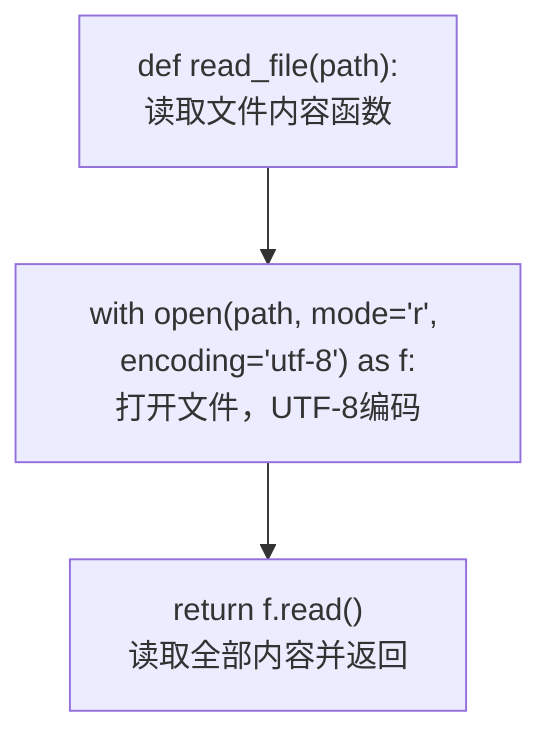

### 2.3 `drag_sensitive()` 脱敏函数

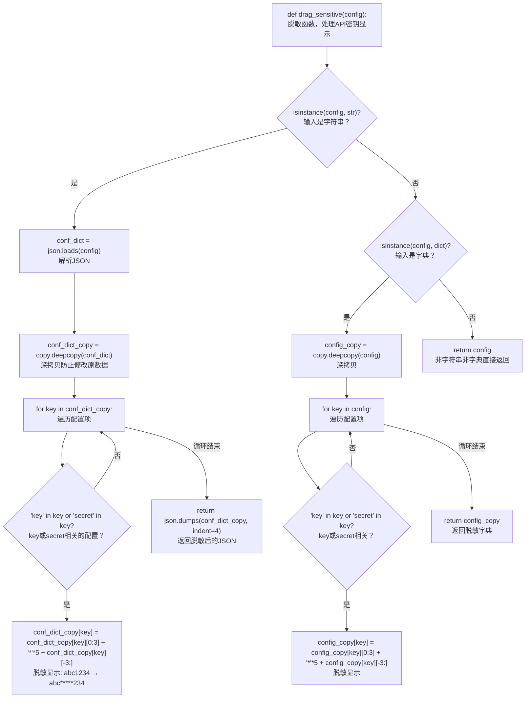

### 2.4 `Config.__init__()` 初始化

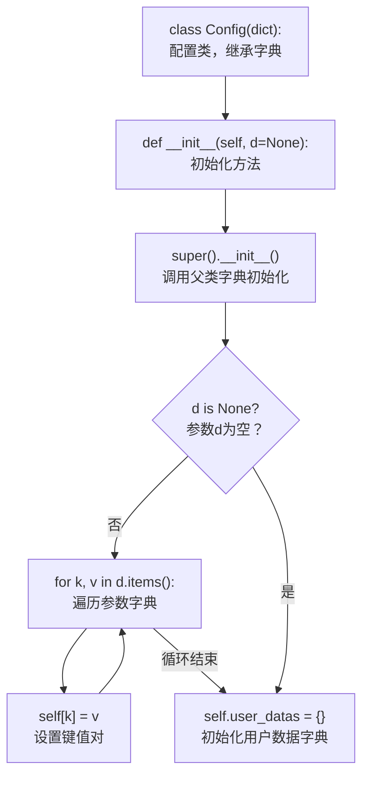

### 2.5 `Config.load_user_datas()` 加载用户数据

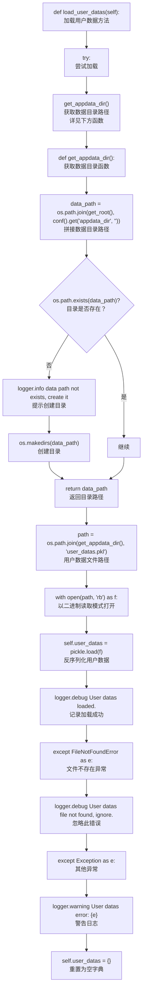

### 2.6 `Config.get_user_data()` 获取用户数据

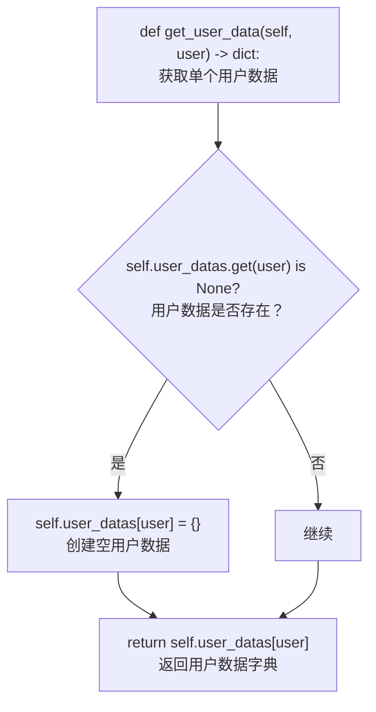

---

## 三、ChannelManager启动流程

### 3.1 `ChannelManager.__init__()` 初始化

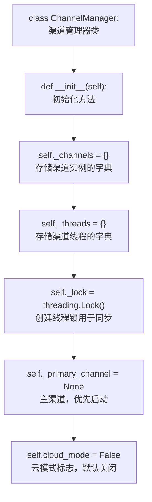

### 3.2 `ChannelManager.start()` 启动

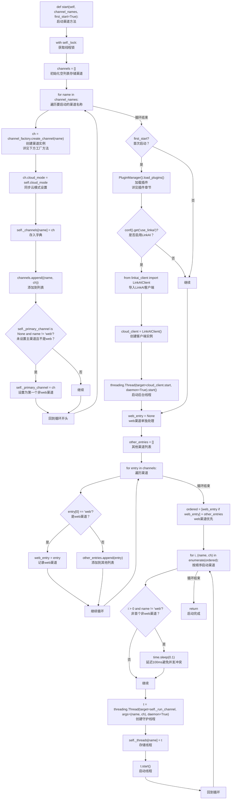

### 3.3 渠道工厂 `create_channel()`

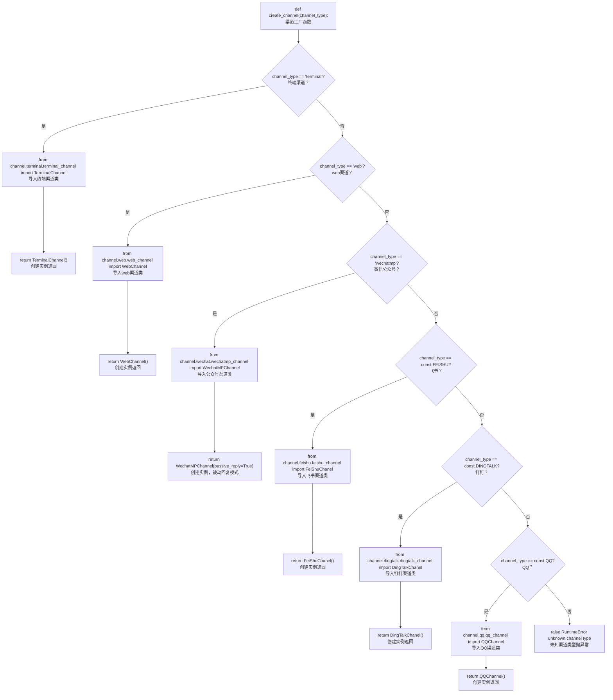

### 3.4 `ChannelManager._run_channel()` 运行渠道

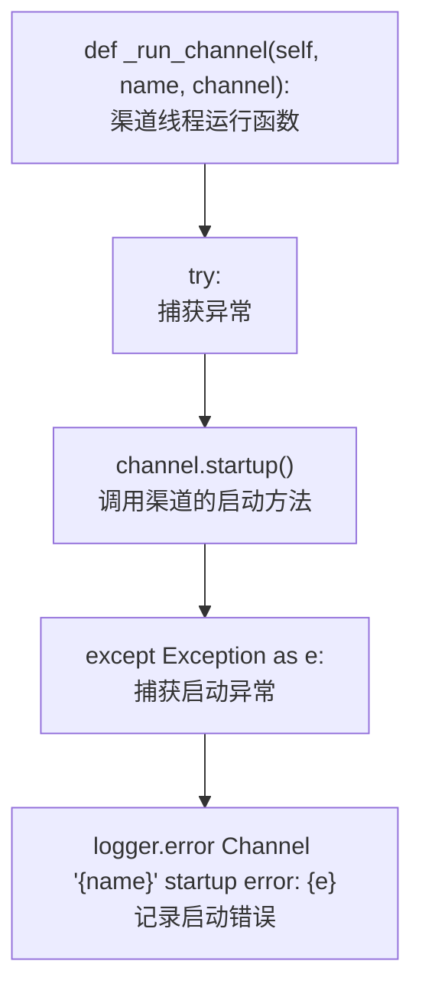

---

## 四、WebChannel启动流程

### 4.1 `WebChannel.__init__()` 初始化

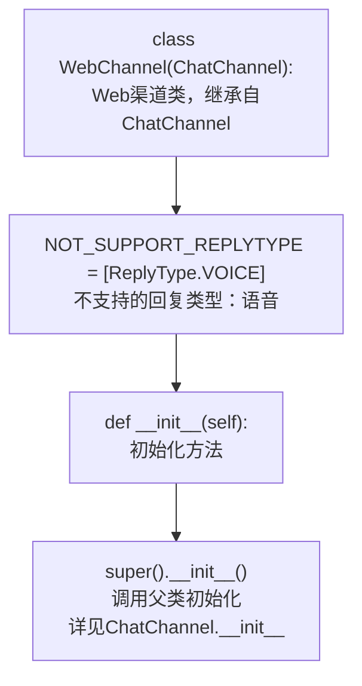

### 4.2 `ChatChannel.__init__()` 父类初始化

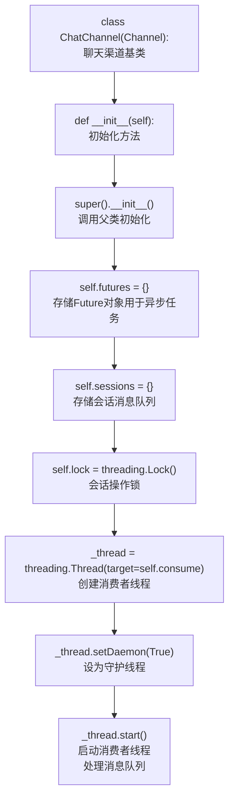

### 4.3 `WebChannel.startup()` 启动HTTP服务

```mermaid
flowchart TD
    A1["def startup(self):<br/>启动Web服务方法"]
    A1 --> A2["port = conf().get('web_port', 9899)<br/>获取端口配置，默认9899"]
    A2 --> A3["logger.info 全部可用通道如下...<br/>打印可用渠道列表"]
    A3 --> A4["logger.info 1. web - 网页<br/>web渠道说明"]
    A4 --> A5["logger.info 2. terminal - 终端<br/>终端渠道说明"]
    A5 --> A6["logger.info 3. feishu - 飞书<br/>飞书渠道说明"]
    A6 --> A7["logger.info 4. dingtalk - 钉钉<br/>钉钉渠道说明"]
    A7 --> A8["logger.info 5. wechatcom_app - 企微自建应用<br/>企业微信说明"]
    A8 --> A9["logger.info 6. wechatmp - 个人公众号<br/>公众号说明"]
    A9 --> A10["logger.info 7. wechatmp_service - 企业公众号<br/>企业公众号说明"]
    A10 --> A11["logger.info Web控制台已运行<br/>提示启动成功"]
    A11 --> A12["logger.info 本地访问: http://localhost:{port}<br/>打印访问地址"]
    
    A12 --> B1["static_dir = os.path.join(os.path.dirname(__file__), 'static')<br/>静态文件目录"]
    B1 --> B2{"os.path.exists(static_dir)?<br/>目录是否存在？"}
    B2 -->|否| B3["os.makedirs(static_dir)<br/>创建静态目录"]
    B2 -->|是| B4["继续"]
    B3 --> B4
    
    B4 --> C1["urls = ('/', 'RootHandler', '/message', 'MessageHandler', ...)<br/>定义URL路由元组"]
    C1 --> C2["app = web.application(urls, globals(), autoreload=False)<br/>创建web.py应用"]
    C2 --> C3["web.httpserver.LogMiddleware.log = lambda: None<br/>禁用web.py访问日志"]
    C3 --> C4["logging.getLogger('web').setLevel(logging.ERROR)<br/>设置web模块日志级别"]
    C4 --> C5["logging.getLogger('web.httpserver').setLevel(logging.ERROR)<br/>设置HTTP日志级别"]
    
    C5 --> D1["func = web.httpserver.StaticMiddleware(app.wsgifunc())<br/>包装静态文件中间件"]
    D1 --> D2["func = web.httpserver.LogMiddleware(func)<br/>包装日志中间件"]
    D2 --> D3["server = web.httpserver.WSGIServer(('0.0.0.0', port), func)<br/>创建WSGI服务器"]
    D3 --> D4["server.daemon_threads = True<br/>守护线程模式"]
    D4 --> D5["self._http_server = server<br/>保存服务器引用"]
    
    D5 --> E1["try:<br/>尝试启动"]
    E1 --> E2["server.start()<br/>启动服务器，阻塞直到退出"]
    E2 --> E3["except (KeyboardInterrupt, SystemExit):<br/>捕获中断异常"]
    E3 --> E4["server.stop()<br/>停止服务器"]
```

---

## 五、消息接收流程

### 5.1 HTTP入口 `MessageHandler.POST()`

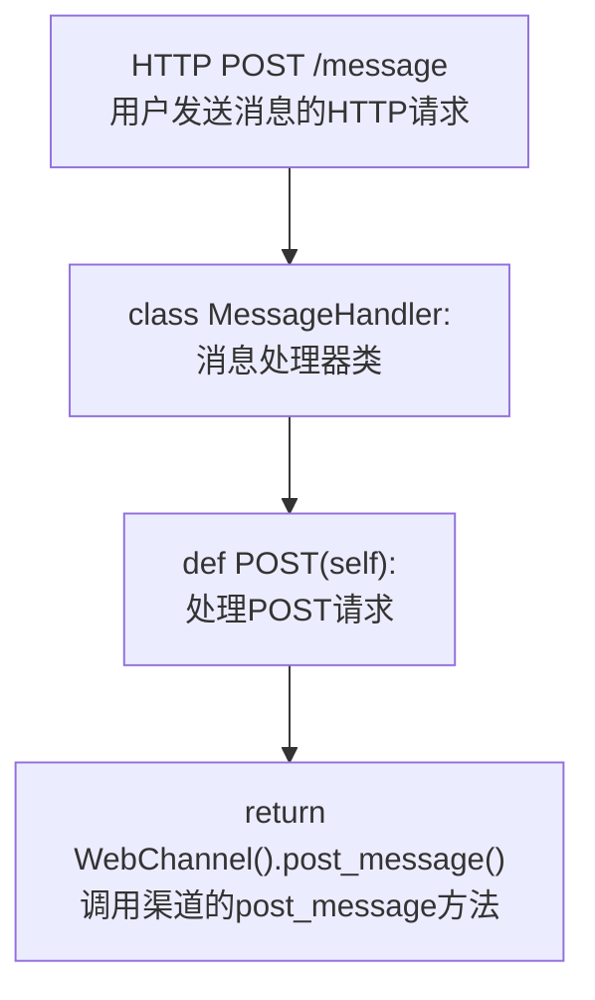

### 5.2 `WebChannel.post_message()` 处理消息

```mermaid
flowchart TD
    A1["def post_message(self):<br/>处理接收到的消息"]
    A1 --> A2["try:<br/>捕获处理中的异常"]
    A2 --> A3["data = web.data()<br/>获取HTTP请求体"]
    A3 --> A4["json_data = json.loads(data)<br/>解析JSON数据"]
    
    A4 --> B1["session_id = json_data.get('session_id', f'session_{int(time.time())}')<br/>获取或生成会话ID"]
    B1 --> B2["prompt = json_data.get('message', '')<br/>获取用户消息内容"]
    B2 --> B3["use_sse = json_data.get('stream', True)<br/>是否使用SSE流式响应"]
    B3 --> B4["attachments = json_data.get('attachments', [])<br/>获取附件列表"]
    
    B4 --> C1{"attachments?<br/>有附件？"}
    C1 -->|是| C2["file_refs = []<br/>初始化附件引用列表"]
    C2 --> C3["for att in attachments:<br/>遍历每个附件"]
    C3 --> C4["ftype = att.get('file_type', 'file')<br/>获取附件类型"]
    C4 --> C5["fpath = att.get('file_path', '')<br/>获取附件路径"]
    C5 --> C6{"not fpath?<br/>路径为空？"}
    C6 -->|是| C3
    C6 -->|否| C7{"ftype == 'image'?<br/>是图片？"}
    C7 -->|是| C8["file_refs.append(f'[图片: {fpath}]')<br/>添加图片标记"]
    C7 -->|否| C9{"ftype == 'video'?<br/>是视频？"}
    C9 -->|是| C10["file_refs.append(f'[视频: {fpath}]')<br/>添加视频标记"]
    C9 -->|否| C11["file_refs.append(f'[文件: {fpath}]')<br/>添加文件标记"]
    C8 --> C3
    C10 --> C3
    C11 --> C3
    C3 -->|循环结束| C12{"file_refs?<br/>有附件引用？"}
    C12 -->|是| C13["prompt = prompt + '\\n' + '\\n'.join(file_refs)<br/>追加到消息内容"]
    C12 -->|否| C14["继续"]
    C13 --> C14
    C1 -->|否| C14
    
    C14 --> D1["request_id = self._generate_request_id()<br/>生成唯一请求ID"]
    D1 --> D2["def _generate_request_id(self):<br/>生成请求ID方法"]
    D2 --> D3["return str(uuid.uuid4())<br/>返回UUID字符串"]
    D3 --> D4["self.request_to_session[request_id] = session_id<br/>建立请求与会话映射"]
    
    D4 --> E1{"session_id not in self.session_queues?<br/>会话队列不存在？"}
    E1 -->|是| E2["self.session_queues[session_id] = Queue()<br/>创建新队列"]
    E1 -->|否| E3["继续"]
    E2 --> E4{"use_sse?<br/>使用SSE？"}
    E3 --> E4
    E4 -->|是| E5["self.sse_queues[request_id] = Queue()<br/>创建SSE队列"]
    E4 -->|否| E6["继续"]
    E5 --> E6
    
    E6 --> F1["trigger_prefixs = conf().get('single_chat_prefix', [''])<br/>获取触发前缀"]
    F1 --> F2["check_prefix(prompt, trigger_prefixs)<br/>检查是否包含前缀<br/>详见check_prefix函数"]
    F2 --> F3{"结果为None且trigger_prefixs非空？<br/>没有匹配前缀？"}
    F3 -->|是| F4["prompt = trigger_prefixs[0] + prompt<br/>自动添加前缀"]
    F3 -->|否| F5["继续"]
    F4 --> F5
    
    F5 --> G1["msg = WebMessage(self._generate_msg_id(), prompt)<br/>创建WebMessage对象"]
    G1 --> G2["msg.from_user_id = session_id<br/>设置发送者ID"]
    
    G2 --> H1["context = self._compose_context(ContextType.TEXT, prompt, msg=msg, isgroup=False)<br/>构造上下文<br/>详见_compose_context章节"]
    H1 --> H2{"context is None?<br/>上下文为空？"}
    H2 -->|是| H3{"request_id in self.sse_queues?<br/>有SSE队列？"}
    H3 -->|是| H4["del self.sse_queues[request_id]<br/>删除队列"]
    H3 -->|否| H5["继续"]
    H4 --> H6["return json.dumps({'status': 'error', 'message': 'Message filtered'})<br/>返回过滤消息错误"]
    H2 -->|否| H6
    
    H6 --> I1["context['session_id'] = session_id<br/>设置会话ID到上下文"]
    I1 --> I2["context['receiver'] = session_id<br/>设置接收者"]
    I2 --> I3["context['request_id'] = request_id<br/>设置请求ID"]
    
    I3 --> J1{"use_sse?<br/>使用SSE？"}
    J1 -->|是| J2["context['on_event'] = self._make_sse_callback(request_id)<br/>创建事件回调"]
    J1 -->|否| J3["继续"]
    J2 --> J3
    
    J3 --> K1["threading.Thread(target=self.produce, args=(context,)).start()<br/>启动消息处理线程"]
    K1 --> K2["return json.dumps({'status': 'success', 'request_id': request_id, 'stream': use_sse})<br/>返回成功响应"]
```

### 5.3 `check_prefix()` 前缀检查函数

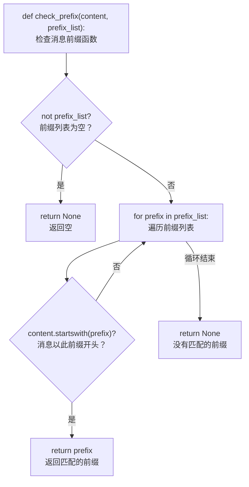

### 5.4 `ChatChannel._compose_context()` 构造上下文

```mermaid
flowchart TD
    A1["def _compose_context(self, ctype, content, **kwargs):<br/>构造消息上下文"]
    A1 --> A2["context = Context(ctype, content)<br/>创建Context对象"]
    A2 --> A3["context.kwargs = kwargs<br/>存储额外参数"]
    A3 --> A4{"'channel_type' not in context?<br/>未设置渠道类型？"}
    A4 -->|是| A5["context['channel_type'] = self.channel_type<br/>设置渠道类型"]
    A4 -->|否| A6["继续"]
    A5 --> A7{"'origin_ctype' not in context?<br/>未设置原始类型？"}
    A6 --> A7
    A7 -->|是| A8["context['origin_ctype'] = ctype<br/>设置原始消息类型"]
    A7 -->|否| A9["继续"]
    A8 --> A9
    
    A9 --> B1["first_in = 'receiver' not in context<br/>判断是否首次进入"]
    B1 --> B2{"first_in?<br/>首次进入？"}
    B2 -->|是| B3["config = conf()<br/>获取配置"]
    B3 --> B4["cmsg = context['msg']<br/>获取消息对象"]
    B4 --> B5["user_data = conf().get_user_data(cmsg.from_user_id)<br/>获取用户数据"]
    B5 --> B6["context['openai_api_key'] = user_data.get('openai_api_key')<br/>设置用户API Key"]
    B6 --> B7["context['gpt_model'] = user_data.get('gpt_model')<br/>设置用户指定模型"]
    
    B7 --> C1{"context.get('isgroup', False)?<br/>是群聊消息？"}
    C1 -->|是| C2["group_name = cmsg.other_user_nickname<br/>获取群名称"]
    C2 --> C3["group_id = cmsg.other_user_id<br/>获取群ID"]
    C3 --> C4["group_name_white_list = config.get('group_name_white_list', [])<br/>获取群白名单"]
    C4 --> C5["group_name_keyword_white_list = config.get('group_name_keyword_white_list', [])<br/>获取群关键词白名单"]
    
    C5 --> D1["检查群名是否在白名单或匹配关键词<br/>any(群名 in 白名单, ALL_GROUP in 白名单, 群名匹配关键词)"]
    D1 --> D2{"any结果?<br/>允许此群？"}
    D2 -->|是| D3["group_shared_session = conf().get('group_shared_session', True)<br/>获取群会话共享设置"]
    D3 --> D4{"group_shared_session?<br/>共享会话？"}
    D4 -->|是| D5["session_id = group_id<br/>全群共享一个session_id"]
    D4 -->|否| D6["session_id = cmsg.actual_user_id<br/>每人独立session_id"]
    D5 --> D7["context['session_id'] = session_id<br/>设置会话ID"]
    D6 --> D7
    D7 --> D8["context['receiver'] = group_id<br/>设置接收者为群ID"]
    D2 -->|否| D9["logger.debug No need reply, groupName not in whitelist<br/>不在白名单"]
    D9 --> D10["return None<br/>不回复"]
    
    C1 -->|否| E1["context['session_id'] = cmsg.other_user_id<br/>私聊：设置会话ID为用户ID"]
    E1 --> E2["context['receiver'] = cmsg.other_user_id<br/>设置接收者"]
    
    D8 --> F1["e_context = PluginManager().emit_event(...)<br/>触发ON_RECEIVE_MESSAGE事件"]
    E2 --> F1
    F1 --> F2["context = e_context['context']<br/>获取处理后的上下文"]
    F2 --> F3{"e_context.is_pass() or context is None?<br/>插件拦截或上下文被清空？"}
    F3 -->|是| F4["return context<br/>直接返回"]
    F3 -->|否| F5["继续"]
    
    F5 --> G1{"自己发送的消息且不允许触发自己？<br/>cmsg.from_user_id == self.user_id and not trigger_by_self"}
    G1 -->|是| G2["logger.debug self message skipped<br/>跳过自己的消息"]
    G2 --> G3["return None<br/>不回复"]
    G1 -->|否| G4["继续"]
    
    G4 --> H1{"ctype == ContextType.TEXT?<br/>文本消息？"}
    H1 -->|是| H2{"引用消息且包含分隔符？<br/>first_in and '」\\n- - - - - - -' in content"}
    H2 -->|是| H3["logger.debug reference query skipped<br/>跳过引用消息"]
    H3 --> H4["return None<br/>不回复"]
    H2 -->|否| H5["nick_name_black_list = conf().get('nick_name_black_list', [])<br/>获取昵称黑名单"]
    H5 --> H6{"context.get('isgroup', False)?<br/>群聊？"}
    
    H6 -->|是 群聊| I1["match_prefix = check_prefix(content, group_chat_prefix)<br/>检查群聊前缀"]
    I1 --> I2["match_contain = check_contain(content, group_chat_keyword)<br/>检查群聊关键词"]
    I2 --> I3["flag = False<br/>初始化触发标志"]
    I3 --> I4{"消息是发给机器人的？<br/>to_user_id != actual_user_id"}
    I4 -->|是| I5{"前缀或关键词匹配？<br/>match_prefix or match_contain"}
    I5 -->|是| I6["flag = True<br/>标记触发"]
    I6 --> I7{"match_prefix?<br/>有前缀？"}
    I7 -->|是| I8["content = content.replace(match_prefix, '', 1).strip()<br/>移除前缀"]
    I7 -->|否| I9["继续"]
    I8 --> I9
    I5 -->|否| I9
    I9 --> I10{"被@了？<br/>cmsg.is_at"}
    I10 -->|是| I11["nick_name = cmsg.actual_user_nickname<br/>获取发送者昵称"]
    I11 --> I12{"昵称在黑名单？<br/>nick_name in nick_name_black_list"}
    I12 -->|是| I13["return None<br/>黑名单用户不回复"]
    I12 -->|否| I14{"没有关闭@触发？<br/>not group_at_off"}
    I14 -->|是| I15["flag = True<br/>标记触发"]
    I14 -->|否| I16["继续"]
    I15 --> I17["pattern = f'@{re.escape(self.name)}(\\u2005|\\u0020)'<br/>构造@匹配正则"]
    I16 --> I17
    I17 --> I18["content = re.sub(pattern, r'', content)<br/>移除@提及"]
    I10 -->|否| I19["继续"]
    I18 --> I19
    I19 --> I20{"not flag?<br/>未触发？"}
    I20 -->|是| I21["return None<br/>不回复"]
    I20 -->|否| I22["继续"]
    
    H6 -->|否 私聊| J1["nick_name = cmsg.from_user_nickname<br/>获取发送者昵称"]
    J1 --> J2{"昵称在黑名单？<br/>nick_name in nick_name_black_list"}
    J2 -->|是| J3["return None<br/>黑名单用户不回复"]
    J2 -->|否| J4["match_prefix = check_prefix(content, single_chat_prefix)<br/>检查私聊前缀"]
    J4 --> J5{"match_prefix is not None?<br/>匹配到前缀？"}
    J5 -->|是| J6["content = content.replace(match_prefix, '', 1).strip()<br/>移除前缀"]
    J5 -->|否| J7{"原始类型是语音？<br/>origin_ctype == VOICE"}
    J7 -->|是| J8["pass 放宽条件<br/>语音消息允许无前缀"]
    J7 -->|否| J9["logger.info checkprefix didn't match<br/>前缀不匹配"]
    J8 --> J10["继续"]
    J6 --> J10
    J9 --> J11["return None<br/>不回复"]
    
    I22 --> K1["content = content.strip()<br/>去除首尾空白"]
    J10 --> K1
    K1 --> K2["img_match_prefix = check_prefix(content, image_create_prefix)<br/>检查图片生成前缀"]
    K2 --> K3{"img_match_prefix?<br/>匹配到图片前缀？"}
    K3 -->|是| K4["content = content.replace(img_match_prefix, '', 1)<br/>移除图片前缀"]
    K4 --> K5["context.type = ContextType.IMAGE_CREATE<br/>设置消息类型为图片生成"]
    K3 -->|否| K6["context.type = ContextType.TEXT<br/>设置消息类型为文本"]
    K5 --> K7["context.content = content.strip()<br/>更新消息内容"]
    K6 --> K7
    
    K7 --> L1{"elif context.type == ContextType.VOICE?<br/>语音消息？"}
    L1 -->|是| L2{"未设置期望回复类型且启用语音回复？<br/>'desire_rtype' not in context and voice_reply_voice"}
    L2 -->|是| L3{"语音类型在支持列表？<br/>ReplyType.VOICE not in NOT_SUPPORT_REPLYTYPE"}
    L3 -->|是| L4["context['desire_rtype'] = ReplyType.VOICE<br/>设置期望回复类型为语音"]
    L2 -->|否| L5["继续"]
    L3 -->|否| L5
    L4 --> L6["return context<br/>返回上下文"]
    L5 --> L6
    L1 -->|否| L6
```

---

## 六、消息处理流程

### 6.1 `ChatChannel.produce()` 消息入队

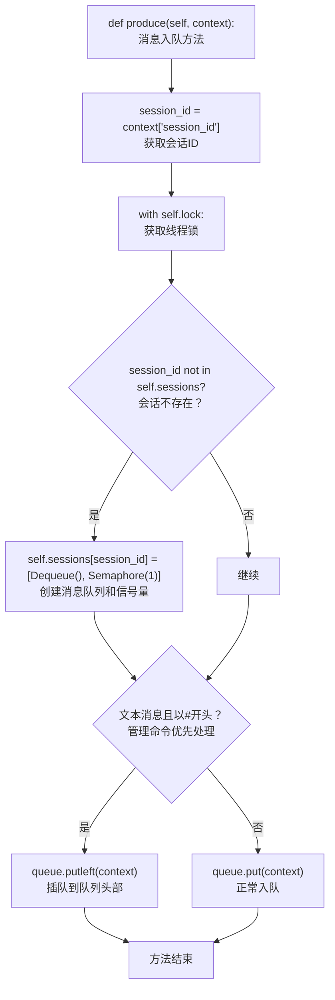

### 6.2 `ChatChannel.consume()` 消息消费循环

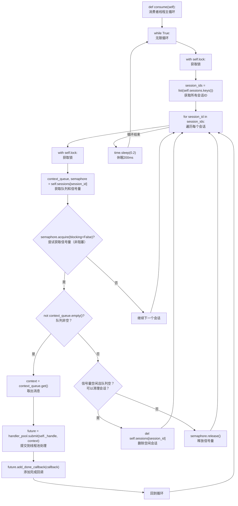

### 6.3 `ChatChannel._handle()` 消息处理三阶段

```mermaid
flowchart TD
    A1["def _handle(self, context):<br/>消息处理主函数"]
    A1 --> A2{"context is None or not context.content?<br/>空消息？"}
    A2 -->|是| A3["return 直接返回"]
    A2 -->|否| A4["logger.debug handling context<br/>打印调试日志"]
    
    A4 --> B1["# 第一阶段：生成回复"]
    B1 --> B2["reply = self._generate_reply(context)<br/>生成回复内容"]
    B2 --> B3["详见_generate_reply章节"]
    
    B3 --> C1{"reply and reply.content?<br/>有效回复？"}
    C1 -->|是| C2["logger.debug decorating reply<br/>打印调试日志"]
    C2 --> C3["# 第二阶段：装饰回复"]
    C3 --> C4["reply = self._decorate_reply(context, reply)<br/>添加前后缀等装饰"]
    C4 --> C5["详见_decorate_reply章节"]
    C5 --> C6["# 第三阶段：发送回复"]
    C6 --> C7["self._send_reply(context, reply)<br/>发送回复到客户端"]
    C7 --> C8["详见_send_reply章节"]
    C1 -->|否| C9["方法结束"]
    C8 --> C9
```

### 6.4 `ChatChannel._generate_reply()` 生成回复

```mermaid
flowchart TD
    A1["def _generate_reply(self, context, reply=Reply()):<br/>生成回复内容"]
    A1 --> A2["e_context = PluginManager().emit_event(ON_HANDLE_CONTEXT)<br/>触发插件事件"]
    A2 --> A3["reply = e_context['reply']<br/>获取插件处理结果"]
    A3 --> A4{"e_context.is_pass()?<br/>插件已处理？"}
    A4 -->|是| A5["return reply<br/>直接返回插件结果"]
    A4 -->|否| A6["logger.debug type, content<br/>打印调试日志"]
    
    A6 --> B1{"context.type == TEXT or IMAGE_CREATE?<br/>文本或图片生成？"}
    B1 -->|是| B2["context['channel'] = channel<br/>设置渠道引用"]
    B2 --> B3["reply = super().build_reply_content(content, context)<br/>构建回复内容<br/>详见Bot调用章节"]
    
    B1 -->|否| C1{"context.type == ContextType.VOICE?<br/>语音消息？"}
    C1 -->|是| C2["cmsg.prepare()<br/>准备音频文件"]
    C2 --> C3["file_path = context.content<br/>获取音频路径"]
    C3 --> C4["wav_path = os.path.splitext(file_path)[0] + '.wav'<br/>生成wav路径"]
    C4 --> C5["try: any_to_wav(file_path, wav_path)<br/>尝试转换格式"]
    C5 --> C6["except: wav_path = file_path<br/>失败则用原文件"]
    C6 --> C7["reply = super().build_voice_to_text(wav_path)<br/>语音识别转文字"]
    C7 --> C8["try: os.remove(file_path)<br/>删除临时文件"]
    C8 --> C9{"reply.type == ReplyType.TEXT?<br/>识别结果是文字？"}
    C9 -->|是| C10["new_context = self._compose_context(TEXT, reply.content)<br/>重新构造上下文"]
    C10 --> C11{"new_context?<br/>上下文有效？"}
    C11 -->|是| C12["reply = self._generate_reply(new_context)<br/>递归处理文字"]
    C11 -->|否| C13["return 返回"]
    C9 -->|否| C14["继续"]
    C12 --> C14
    
    C1 -->|否| D1{"context.type == ContextType.IMAGE?<br/>图片消息？"}
    D1 -->|是| D2["memory.USER_IMAGE_CACHE[session_id] = {path, msg}<br/>缓存图片信息"]
    D1 -->|否| D3{"context.type == ContextType.SHARING?<br/>分享消息？"}
    D3 -->|是| D4["pass 跳过"]
    D3 -->|否| D5{"context.type in [FUNCTION, FILE]?<br/>函数或文件？"}
    D5 -->|是| D6["pass 跳过"]
    D5 -->|否| D7["logger.warning unknown context type<br/>未知类型警告"]
    D7 --> D8["return"]
    
    D2 --> E1["return reply<br/>返回回复"]
    D4 --> E1
    D6 --> E1
    D14 --> E1
    B3 --> E1
```

### 6.5 `ChatChannel._decorate_reply()` 装饰回复

```mermaid
flowchart TD
    A1["def _decorate_reply(self, context, reply):<br/>装饰回复内容"]
    A1 --> A2{"reply and reply.type?<br/>有效回复？"}
    A2 -->|否| A3["跳过装饰"]
    A2 -->|是| A4["e_context = PluginManager().emit_event(ON_DECORATE_REPLY)<br/>触发插件事件"]
    A4 --> A5["reply = e_context['reply']<br/>获取处理后回复"]
    A5 --> A6["desire_rtype = context.get('desire_rtype')<br/>获取期望的回复类型"]
    
    A6 --> B1{"未被插件处理且有效回复？<br/>not is_pass and reply"}
    B1 -->|否| B2["跳过"]
    B1 -->|是| B3{"reply.type in NOT_SUPPORT_REPLYTYPE?<br/>不支持的类型？"}
    B3 -->|是| B4["logger.error type not support<br/>记录错误"]
    B4 --> B5["reply.type = ReplyType.ERROR<br/>设为错误类型"]
    B5 --> B6["reply.content = '不支持发送的消息类型'<br/>设置错误消息"]
    
    B3 -->|否| C1{"reply.type == ReplyType.TEXT?<br/>文本回复？"}
    C1 -->|是| C2["reply_text = reply.content<br/>获取文本内容"]
    C2 --> C3{"需要语音回复且支持？<br/>desire_rtype == VOICE and supported"}
    C3 -->|是| C4["reply = super().build_text_to_voice(reply.content)<br/>文字转语音"]
    C4 --> C5["return self._decorate_reply(context, reply)<br/>递归装饰"]
    C3 -->|否| C6{"context.get('isgroup')?<br/>群聊？"}
    C6 -->|是| C7{"不需要@？<br/>no_need_at == False"}
    C7 -->|是| C8["reply_text = '@' + nickname + '\\n' + reply_text<br/>添加@发送者"]
    C7 -->|否| C9["继续"]
    C8 --> C10["reply_text = prefix + reply_text + suffix<br/>添加群聊前后缀"]
    C9 --> C10
    C6 -->|否 私聊| C11["reply_text = prefix + reply_text + suffix<br/>添加私聊前后缀"]
    C10 --> C12["reply.content = reply_text<br/>更新内容"]
    C11 --> C12
    
    C1 -->|否| D1{"reply.type == ERROR or INFO?<br/>错误或信息类型？"}
    D1 -->|是| D2["reply.content = '[' + type + ']\\n' + content<br/>添加类型标识"]
    D1 -->|否| D3{"reply.type in [IMAGE_URL, VOICE, IMAGE, FILE, VIDEO]?<br/>媒体类型？"}
    D3 -->|是| D4["pass 不需要装饰"]
    D3 -->|否| D5["logger.error unknown reply type<br/>未知类型错误"]
    D5 --> D6["return"]
    
    B2 --> E1["return reply<br/>返回装饰后的回复"]
    C5 --> E1
    C12 --> E1
    D2 --> E1
    D4 --> E1
    A3 --> E1
```

### 6.6 `ChatChannel._send_reply()` 发送回复

```mermaid
flowchart TD
    A1["def _send_reply(self, context, reply):<br/>发送回复"]
    A1 --> A2{"reply and reply.type?<br/>有效回复？"}
    A2 -->|否| A3["跳过"]
    A2 -->|是| A4["e_context = PluginManager().emit_event(ON_SEND_REPLY)<br/>触发插件事件"]
    A4 --> A5["reply = e_context['reply']<br/>获取处理结果"]
    
    A5 --> B1{"未被处理且有效？<br/>not is_pass and reply"}
    B1 -->|否| B2["跳过"]
    B1 -->|是| B3["logger.debug sending reply<br/>打印调试日志"]
    
    B3 --> C1{"reply.type == ReplyType.TEXT?<br/>文本回复？"}
    C1 -->|是| C2["self._extract_and_send_images(reply, context)<br/>提取并发送图片"]
    C1 -->|否| C3{"图片URL且有文本？<br/>reply.type == IMAGE_URL and text_content"}
    C3 -->|是| C4["text_reply = Reply(TEXT, text_content)<br/>创建文本回复"]
    C4 --> C5["self._send(text_reply, context)<br/>先发文本"]
    C5 --> C6["time.sleep(0.3)<br/>延迟300ms"]
    C6 --> C7["self._send(reply, context)<br/>再发图片"]
    C3 -->|否| C8["self._send(reply, context)<br/>直接发送"]
    
    C2 --> D1["# 从文本提取媒体链接"]
    D1 --> D2["content = reply.content<br/>获取文本内容"]
    D2 --> D3["media_items = []<br/>媒体列表"]
    D3 --> D4["patterns = [图片、视频、URL正则...]<br/>匹配模式列表"]
    D4 --> D5["for pattern, type in patterns:<br/>遍历每种模式"]
    D5 --> D6["matches = re.findall(pattern, content)<br/>正则匹配"]
    D6 --> D7["for match in matches:<br/>遍历匹配结果"]
    D7 --> D8["media_items.append((match, type))<br/>添加到媒体列表"]
    D8 --> D7
    D7 -->|循环结束| D5
    D5 -->|循环结束| D9["media_items = unique_items[:5]<br/>去重并限制最多5个"]
    
    D9 --> E1{"media_items?<br/>有媒体？"}
    E1 -->|是| E2["self._send(reply, context)<br/>先发送文本"]
    E2 --> E3["for i, (url, type) in enumerate(media_items):<br/>遍历媒体"]
    E3 --> E4{"i > 0?<br/>不是第一个？"}
    E4 -->|是| E5["time.sleep(0.5)<br/>延迟500ms"]
    E4 -->|否| E6["继续"]
    E5 --> E6
    E6 --> E7["创建media_reply<br/>创建媒体回复对象"]
    E7 --> E8["self._send(media_reply, context)<br/>发送媒体"]
    E8 --> E3
    E3 -->|循环结束| E9["方法结束"]
    E1 -->|否| E10["self._send(reply, context)<br/>只发送文本"]
    E10 --> E9
```

### 6.7 `WebChannel.send()` Web渠道发送

```mermaid
flowchart TD
    A1["def send(self, reply, context):<br/>Web渠道发送方法"]
    A1 --> A2["try:<br/>捕获异常"]
    A2 --> A3{"reply.type in NOT_SUPPORT_REPLYTYPE?<br/>不支持的类型？"}
    A3 -->|是| A4["logger.warning doesn't support<br/>记录警告"]
    A4 --> A5["return 直接返回"]
    A3 -->|否| A6{"reply.type == IMAGE_URL?<br/>图片URL？"}
    A6 -->|是| A7["time.sleep(0.5)<br/>延迟500ms"]
    A6 -->|否| A8["继续"]
    A7 --> A8
    
    A8 --> B1["request_id = context.get('request_id')<br/>获取请求ID"]
    B1 --> B2{"not request_id?<br/>没有请求ID？"}
    B2 -->|是| B3["logger.error No request_id<br/>记录错误"]
    B3 --> B4["return"]
    B2 -->|否| B5["session_id = self.request_to_session.get(request_id)<br/>获取会话ID"]
    B5 --> B6{"not session_id?<br/>没有会话ID？"}
    B6 -->|是| B7["logger.error No session_id<br/>记录错误"]
    B7 --> B8["return"]
    B6 -->|否| B9["继续"]
    
    B9 --> C1{"request_id in self.sse_queues?<br/>SSE模式？"}
    C1 -->|是 SSE模式| C2["content = reply.content or ''<br/>获取内容"]
    C2 --> C3["self.sse_queues[request_id].put({type: 'done', content, request_id, timestamp})<br/>推送到SSE队列"]
    C3 --> C4["logger.debug SSE done sent<br/>记录发送成功"]
    C4 --> C5["return"]
    
    C1 -->|否 轮询模式| D1{"session_id in session_queues?<br/>有轮询队列？"}
    D1 -->|是| D2["response_data = {type, content, timestamp, request_id}<br/>构造响应数据"]
    D2 --> D3["self.session_queues[session_id].put(response_data)<br/>推送到轮询队列"]
    D3 --> D4["logger.debug Response sent<br/>记录发送成功"]
    D1 -->|否| D5["logger.warning No queue<br/>警告没有队列"]
    
    C5 --> E1["except Exception as e:<br/>捕获异常"]
    D4 --> E1
    D5 --> E1
    E1 --> E2["logger.error Error in send: {e}<br/>记录错误"]
```

---

## 七、Bot模型调用流程

### 7.1 `Bridge.__init__()` 初始化

```mermaid
flowchart TD
    A1["class Bridge:<br/>桥接类，管理Bot实例"]
    A1 --> A2["@singleton<br/>单例装饰器，全局只有一个实例"]
    A2 --> A3["def __init__(self):<br/>初始化方法"]
    A3 --> A4["self.btype = {chat: OPENAI, voice_to_text: 'openai', text_to_voice: 'google', translate: 'baidu'}<br/>默认Bot类型映射"]
    
    A4 --> B1["bot_type = conf().get('bot_type')<br/>获取配置的Bot类型"]
    B1 --> B2{"bot_type?<br/>有配置？"}
    B2 -->|是| B3["self.btype['chat'] = bot_type<br/>使用配置的类型"]
    B2 -->|否| B4["model_type = conf().get('model') or 'gpt-4o-mini'<br/>根据模型名推断类型"]
    
    B4 --> C1["# 根据模型名判断Bot类型"]
    C1 --> C2{"model in ['wenxin', 'wenxin-4']?<br/>文心一言？"}
    C2 -->|是| C3["self.btype['chat'] = const.BAIDU"]
    C2 -->|否| C4{"model in ['xunfei']?<br/>讯飞星火？"}
    C4 -->|是| C5["self.btype['chat'] = const.XUNFEI"]
    C4 -->|否| C6{"model.startswith('qwen')?<br/>通义千问？"}
    C6 -->|是| C7["self.btype['chat'] = const.QWEN_DASHSCOPE"]
    C6 -->|否| C8{"model.startswith('gemini')?<br/>Gemini？"}
    C8 -->|是| C9["self.btype['chat'] = const.GEMINI"]
    C8 -->|否| C10{"model.startswith('glm')?<br/>智谱AI？"}
    C10 -->|是| C11["self.btype['chat'] = const.ZHIPU_AI"]
    C10 -->|否| C12{"model.startswith('claude')?<br/>Claude？"}
    C12 -->|是| C13["self.btype['chat'] = const.CLAUDEAPI"]
    C12 -->|否| C14["继续检查其他模型..."]
    
    C14 --> D1["self.bots = {}<br/>Bot实例缓存字典"]
    D1 --> D2["self.chat_bots = {}<br/>聊天Bot缓存"]
    D2 --> D3["self._agent_bridge = None<br/>Agent桥接实例"]
```

### 7.2 `Bridge.fetch_reply_content()` 获取回复

```mermaid
flowchart TD
    A1["def fetch_reply_content(self, query, context):<br/>获取回复内容"]
    A1 --> A2["bot = self.get_bot('chat')<br/>获取聊天Bot实例"]
    A2 --> A3["return bot.reply(query, context)<br/>调用Bot的reply方法"]
```

### 7.3 `Bridge.get_bot()` 获取Bot实例

```mermaid
flowchart TD
    A1["def get_bot(self, typename):<br/>获取Bot实例"]
    A1 --> A2{"self.bots.get(typename) is None?<br/>实例不存在？"}
    A2 -->|是| A3["logger.info create bot {type} for {typename}<br/>记录创建Bot"]
    A3 --> A4{"typename == 'chat'?<br/>聊天Bot？"}
    A4 -->|是| A5["self.bots[typename] = create_bot(self.btype[typename])<br/>调用工厂创建Bot"]
    A4 -->|否| A6{"typename == 'voice_to_text'?<br/>语音识别？"}
    A6 -->|是| A7["self.bots[typename] = create_voice(...)<br/>创建语音识别Bot"]
    A6 -->|否| A8{"typename == 'text_to_voice'?<br/>语音合成？"}
    A8 -->|是| A9["self.bots[typename] = create_voice(...)<br/>创建语音合成Bot"]
    A8 -->|否| A10["typename == 'translate'<br/>翻译Bot"]
    A2 -->|否| A11["继续"]
    A5 --> A12["return self.bots[typename]<br/>返回Bot实例"]
    A7 --> A12
    A9 --> A12
    A10 --> A12
    A11 --> A12
```

### 7.4 `create_bot()` 工厂方法

```mermaid
flowchart TD
    A1["def create_bot(bot_type):<br/>Bot工厂函数"]
    A1 --> A2{"bot_type == const.BAIDU?<br/>百度文心？"}
    A2 -->|是| A3["from models.baidu import BaiduWenxinBot<br/>导入文心Bot"]
    A3 --> A4["return BaiduWenxinBot()<br/>创建实例"]
    A2 -->|否| A5{"bot_type in [OPENAI, CHATGPT, DEEPSEEK]?<br/>OpenAI兼容？"}
    A5 -->|是| A6["from models.chatgpt import ChatGPTBot<br/>导入ChatGPT Bot"]
    A6 --> A7["return ChatGPTBot()<br/>创建实例"]
    A5 -->|否| A8{"bot_type == const.XUNFEI?<br/>讯飞？"}
    A8 -->|是| A9["from models.xunfei import XunFeiBot<br/>导入讯飞Bot"]
    A9 --> A10["return XunFeiBot()"]
    A8 -->|否| A11{"bot_type == const.CLAUDEAPI?<br/>Claude？"}
    A11 -->|是| A12["from models.claudeapi import ClaudeAPIBot<br/>导入Claude Bot"]
    A12 --> A13["return ClaudeAPIBot()"]
    A11 -->|否| A14{"bot_type == const.QWEN_DASHSCOPE?<br/>通义千问？"}
    A14 -->|是| A15["from models.dashscope import DashscopeBot<br/>导入千问Bot"]
    A15 --> A16["return DashscopeBot()"]
    A14 -->|否| A17["继续检查其他模型..."]
    A17 --> A18["raise RuntimeError unknown bot type<br/>未知Bot类型抛异常"]
```

---

## 八、ChatGPTBot调用流程

### 8.1 `ChatGPTBot.__init__()` 初始化

```mermaid
flowchart TD
    A1["class ChatGPTBot(Bot, OpenAIImage, OpenAICompatibleBot):<br/>ChatGPT Bot类"]
    A1 --> A2["def __init__(self):<br/>初始化方法"]
    A2 --> A3["super().__init__()<br/>调用父类初始化"]
    A3 --> A4["openai.api_key = conf().get('open_ai_api_key')<br/>设置API密钥"]
    A4 --> A5{"conf().get('open_ai_api_base')?<br/>有自定义API地址？"}
    A5 -->|是| A6["openai.api_base = conf().get('open_ai_api_base')<br/>设置API地址"]
    A5 -->|否| A7["继续"]
    A6 --> A8["proxy = conf().get('proxy')<br/>获取代理设置"]
    A7 --> A8
    A8 --> A9{"proxy?<br/>有代理？"}
    A9 -->|是| A10["openai.proxy = proxy<br/>设置代理"]
    A9 -->|否| A11["继续"]
    A10 --> A12{"conf().get('rate_limit_chatgpt')?<br/>启用限流？"}
    A11 --> A12
    A12 -->|是| A13["self.tb4chatgpt = TokenBucket(rate_limit)<br/>创建令牌桶限流器"]
    A12 -->|否| A14["继续"]
    A13 --> A15["conf_model = conf().get('model') or 'gpt-3.5-turbo'<br/>获取模型名"]
    A14 --> A15
    A15 --> A16["self.sessions = SessionManager(ChatGPTSession, model)<br/>创建会话管理器"]
    
    A16 --> B1["self.args = {model, temperature, top_p, frequency_penalty, presence_penalty, timeout}<br/>设置API调用参数"]
    
    B1 --> C1{"conf_model in [O1, O1_MINI, GPT_5, ...]?<br/>特殊模型？"}
    C1 -->|是| C2["remove_keys = ['temperature', 'top_p', ...]<br/>不支持的参数列表"]
    C2 --> C3["for key in remove_keys: self.args.pop(key)<br/>移除不支持的参数"]
    C3 --> C4{"conf_model in [O1, O1_MINI]?<br/>O1系列？"}
    C4 -->|是| C5["self.sessions = SessionManager(BaiduWenxinSession)<br/>O1不支持system prompt"]
    C4 -->|否| C6["方法结束"]
    C1 -->|否| C6
    C5 --> C6
```

### 8.2 `ChatGPTBot.reply()` 回复方法

```mermaid
flowchart TD
    A1["def reply(self, query, context=None):<br/>生成回复方法"]
    A1 --> A2{"context.type == ContextType.TEXT?<br/>文本消息？"}
    A2 -->|是| A3["logger.info [CHATGPT] query={query}<br/>记录查询"]
    A3 --> A4["session_id = context['session_id']<br/>获取会话ID"]
    A4 --> A5["reply = None<br/>初始化回复为空"]
    A5 --> A6["clear_memory_commands = conf().get('clear_memory_commands', ['#清除记忆'])<br/>获取清记忆命令"]
    
    A6 --> B1{"query in clear_memory_commands?<br/>是清记忆命令？"}
    B1 -->|是| B2["self.sessions.clear_session(session_id)<br/>清除当前会话记忆"]
    B2 --> B3["reply = Reply(ReplyType.INFO, '记忆已清除')<br/>返回提示"]
    B1 -->|否| B4{"query == '#清除所有'?<br/>清除所有命令？"}
    B4 -->|是| B5["self.sessions.clear_all_session()<br/>清除所有会话"]
    B5 --> B6["reply = Reply(ReplyType.INFO, '所有人记忆已清除')"]
    B4 -->|否| B7{"query == '#更新配置'?<br/>更新配置命令？"}
    B7 -->|是| B8["load_config()<br/>重新加载配置"]
    B8 --> B9["reply = Reply(ReplyType.INFO, '配置已更新')"]
    B7 -->|否| B10["继续"]
    
    B3 --> C1{"reply?<br/>有回复？"}
    B6 --> C1
    B9 --> C1
    C1 -->|是| C2["return reply<br/>直接返回命令响应"]
    C1 -->|否| C3["session = self.sessions.session_query(query, session_id)<br/>添加用户消息到会话"]
    C3 --> C4["logger.debug session messages<br/>打印会话消息"]
    C4 --> C5["api_key = context.get('openai_api_key')<br/>获取用户自定义API Key"]
    C5 --> C6["model = context.get('gpt_model')<br/>获取用户自定义模型"]
    C6 --> C7{"model?<br/>有自定义模型？"}
    C7 -->|是| C8["new_args = self.args.copy()<br/>复制参数"]
    C8 --> C9["new_args['model'] = model<br/>设置模型"]
    C7 -->|否| C10["继续"]
    C9 --> C10
    
    C10 --> D1["reply_content = self.reply_text(session, api_key, args)<br/>调用API获取回复<br/>详见reply_text"]
    D1 --> D2["logger.debug tokens info<br/>打印token使用信息"]
    D2 --> D3{"completion_tokens == 0 and content > 0?<br/>API返回错误但有内容？"}
    D3 -->|是| D4["reply = Reply(ReplyType.ERROR, content)<br/>错误回复"]
    D3 -->|否| D5{"completion_tokens > 0?<br/>正常返回？"}
    D5 -->|是| D6["self.sessions.session_reply(content, session_id, tokens)<br/>保存AI回复到会话"]
    D6 --> D7["reply = Reply(ReplyType.TEXT, content)<br/>正常回复"]
    D5 -->|否| D8["reply = Reply(ReplyType.ERROR, content)<br/>错误回复"]
    D4 --> D9["return reply"]
    D7 --> D9
    D8 --> D9
    
    A2 -->|否| E1{"context.type == ContextType.IMAGE_CREATE?<br/>图片生成？"}
    E1 -->|是| E2["ok, retstring = self.create_img(query, 0)<br/>生成图片"]
    E2 --> E3{"ok?<br/>成功？"}
    E3 -->|是| E4["reply = Reply(ReplyType.IMAGE_URL, retstring)<br/>返回图片URL"]
    E3 -->|否| E5["reply = Reply(ReplyType.ERROR, retstring)<br/>返回错误"]
    E1 -->|否| E6{"context.type == ContextType.IMAGE?<br/>图片消息？"}
    E6 -->|是| E7["reply = self.reply_image(context)<br/>处理图片Vision API"]
    E6 -->|否| E8["reply = Reply(ReplyType.ERROR, '不支持的消息类型')<br/>返回错误"]
    E4 --> E9["return reply"]
    E5 --> E9
    E7 --> E9
    E8 --> E9
```

### 8.3 `ChatGPTBot.reply_text()` API调用

```mermaid
flowchart TD
    A1["def reply_text(self, session, api_key, args, retry_count=0):<br/>调用OpenAI API"]
    A1 --> A2["try:<br/>尝试调用"]
    A2 --> A3{"启用限流且令牌不足？<br/>rate_limit and not tb.get_token()"}
    A3 -->|是| A4["raise RateLimitError<br/>抛出限流异常"]
    A3 -->|否| A5{"args is None?<br/>参数为空？"}
    A5 -->|是| A6["args = self.args<br/>使用默认参数"]
    A5 -->|否| A7["继续"]
    A6 --> A8["response = openai.ChatCompletion.create(api_key, messages, **args)<br/>调用OpenAI Chat API"]
    A7 --> A8
    
    A8 --> B1["logger.info reply, total_tokens<br/>记录回复和token数"]
    B1 --> B2["return {total_tokens, completion_tokens, content}<br/>返回结果字典"]
    
    A4 --> C1["except Exception as e:<br/>捕获异常"]
    C1 --> C2["need_retry = retry_count < 2<br/>判断是否重试"]
    C2 --> C3["result = {completion_tokens: 0, content: '累了'}<br/>默认错误回复"]
    
    C3 --> D1{"isinstance(e, RateLimitError)?<br/>限流错误？"}
    D1 -->|是| D2["logger.warn RateLimitError<br/>记录限流"]
    D2 --> D3["result['content'] = '提问太快啦'<br/>设置限流提示"]
    D3 --> D4{"need_retry?<br/>需要重试？"}
    D4 -->|是| D5["time.sleep(20)<br/>等待20秒"]
    
    D1 -->|否| E1{"isinstance(e, Timeout)?<br/>超时错误？"}
    E1 -->|是| E2["logger.warn Timeout<br/>记录超时"]
    E2 --> E3["result['content'] = '没有收到消息'<br/>设置超时提示"]
    E3 --> E4{"need_retry?<br/>需要重试？"}
    E4 -->|是| E5["time.sleep(5)<br/>等待5秒"]
    
    E1 -->|否| F1{"isinstance(e, APIError)?<br/>API错误？"}
    F1 -->|是| F2["logger.warn Bad Gateway<br/>记录API错误"]
    F2 --> F3["result['content'] = '请再问我一次'<br/>设置重试提示"]
    F3 --> F4{"need_retry?<br/>需要重试？"}
    F4 -->|是| F5["time.sleep(10)<br/>等待10秒"]
    
    F1 -->|否| G1{"isinstance(e, APIConnectionError)?<br/>连接错误？"}
    G1 -->|是| G2["logger.warn APIConnectionError<br/>记录连接错误"]
    G2 --> G3["result['content'] = '连接不到网络'<br/>设置连接提示"]
    G3 --> G4{"need_retry?<br/>需要重试？"}
    G4 -->|是| G5["time.sleep(5)<br/>等待5秒"]
    
    G1 -->|否| H1["logger.exception Exception<br/>记录异常堆栈"]
    H1 --> H2["need_retry = False<br/>不重试"]
    H2 --> H3["self.sessions.clear_session(session_id)<br/>清除会话"]
    
    D5 --> I1{"need_retry?<br/>需要重试？"}
    E5 --> I1
    F5 --> I1
    G5 --> I1
    D4 -->|否| I1
    E4 -->|否| I1
    F4 -->|否| I1
    G4 -->|否| I1
    H3 --> I1
    
    I1 -->|是| I2["logger.warn 第{retry_count + 1}次重试<br/>记录重试"]
    I2 --> I3["return self.reply_text(..., retry_count + 1)<br/>递归重试"]
    I1 -->|否| I4["return result<br/>返回结果"]
```

---

## 九、Agent模式执行流程

### 9.1 `Bridge.fetch_agent_reply()` Agent回复入口

```mermaid
flowchart TD
    A1["def fetch_agent_reply(self, query, context, on_event, clear_history):<br/>Agent模式回复入口"]
    A1 --> A2["agent_bridge = self.get_agent_bridge()<br/>获取Agent桥接实例"]
    A2 --> A3["return agent_bridge.agent_reply(query, context, on_event, clear_history)<br/>调用Agent回复方法"]
```

### 9.2 `AgentBridge.agent_reply()` Agent回复

```mermaid
flowchart TD
    A1["def agent_reply(self, query, context, on_event, clear_history):<br/>Agent回复主方法"]
    A1 --> A2["session_id = context.kwargs.get('session_id')<br/>获取会话ID"]
    A2 --> A3["agent = self.get_agent(session_id)<br/>获取或创建Agent实例"]
    
    A3 --> B1["event_handler = AgentEventHandler(context, on_event)<br/>创建事件处理器"]
    B1 --> B2{"context.get('is_scheduled_task')?<br/>是定时任务？"}
    B2 -->|是| B3["agent.tools = 排除scheduler工具<br/>防止递归调度"]
    B2 -->|否| B4["继续"]
    B3 --> B4
    
    B4 --> C1["response = agent.run_stream(user_message=query, on_event=event_handler.handle_event, clear_history=clear_history)<br/>运行Agent流式推理<br/>详见Agent.run_stream"]
    C1 --> C2["流式执行Agent循环"]
    
    C2 --> D1{"session_id?<br/>有会话ID？"}
    D1 -->|是| D2["new_messages = agent._last_run_new_messages<br/>获取新消息"]
    D2 --> D3["self._persist_messages(session_id, new_messages, channel_type)<br/>持久化消息"]
    D1 -->|否| D4["继续"]
    D3 --> D4
    
    D4 --> E1{"agent.stream_executor.files_to_send?<br/>有文件要发送？"}
    E1 -->|是| E2["return self._create_file_reply(...)<br/>创建文件回复"]
    E1 -->|否| E3["return Reply(ReplyType.TEXT, response)<br/>返回文本回复"]
```

### 9.3 `Agent.run_stream()` Agent流式执行

```mermaid
flowchart TD
    A1["def run_stream(self, user_message, on_event, clear_history):<br/>Agent流式执行"]
    A1 --> A2{"clear_history?<br/>清空历史？"}
    A2 -->|是| A3["with self.messages_lock: self.messages = []<br/>清空消息历史"]
    A2 -->|否| A4["继续"]
    A3 --> A4
    
    A4 --> B1["full_system_prompt = self.get_full_system_prompt()<br/>获取完整系统提示词"]
    B1 --> B2["包含: 基础提示词 + 工具列表 + 运行时信息 + 技能列表"]
    
    B2 --> C1["with self.messages_lock:<br/>获取消息锁"]
    C1 --> C2["messages_copy = self.messages.copy()<br/>复制消息历史"]
    C2 --> C3["original_length = len(self.messages)<br/>记录原始长度"]
    
    C3 --> D1["executor = AgentStreamExecutor(agent, model, system_prompt, tools, max_turns, ...)<br/>创建流式执行器"]
    D1 --> D2["try: response = executor.run_stream(user_message)<br/>执行流式推理<br/>详见AgentStreamExecutor"]
    
    D2 --> E1["with self.messages_lock:<br/>获取消息锁"]
    E1 --> E2["self.messages = list(executor.messages)<br/>同步消息历史"]
    E2 --> E3["self._last_run_new_messages = executor.messages[original_length:]<br/>提取新消息"]
    
    E3 --> F1["self.stream_executor = executor<br/>保存执行器引用"]
    F1 --> F2["self._execute_post_process_tools()<br/>执行后处理工具"]
    F2 --> F3["return response<br/>返回响应"]
```

### 9.4 `AgentStreamExecutor.run_stream()` 核心推理循环

```mermaid
flowchart TD
    A1["def run_stream(self, user_message):<br/>核心推理循环"]
    A1 --> A2["self.messages.append({role: 'user', content: user_message})<br/>添加用户消息到历史"]
    A2 --> A3["for turn in range(self.max_turns):<br/>最多执行max_turns轮"]
    
    A3 --> B1["request = LLMRequest(messages, system, tools, max_tokens)<br/>构建LLM请求"]
    B1 --> B2["stream = self.model.call_stream(request)<br/>调用LLM流式API"]
    B2 --> B3["accumulated_content = ''<br/>累积的内容"]
    B3 --> B4["tool_calls = []<br/>工具调用列表"]
    
    B4 --> C1["for chunk in stream:<br/>遍历流式响应"]
    C1 --> C2{"chunk.choices[0].delta.content?<br/>有内容增量？"}
    C2 -->|是| C3["delta = chunk.choices[0].delta.content<br/>获取增量内容"]
    C3 --> C4["accumulated_content += delta<br/>累积内容"]
    C4 --> C5{"self.on_event?<br/>有事件回调？"}
    C5 -->|是| C6["self.on_event({type: 'message_update', data: {delta}})<br/>触发消息更新事件"]
    C5 -->|否| C7["继续"]
    C6 --> C7
    C2 -->|否| C8{"chunk.choices[0].delta.tool_calls?<br/>有工具调用？"}
    C8 -->|是| C9["tool_calls.append(tc)<br/>累积工具调用信息"]
    C8 -->|否| C7
    C9 --> C7
    C7 --> C1
    C1 -->|流结束| C10["chunk处理完成"]
    
    C10 --> D1["assistant_message = {role: 'assistant', content: accumulated_content}<br/>构造助手消息"]
    D1 --> D2{"tool_calls?<br/>有工具调用？"}
    D2 -->|是| D3["assistant_message['tool_calls'] = tool_calls<br/>添加工具调用信息"]
    D2 -->|否| D4["继续"]
    D3 --> D5["self.messages.append(assistant_message)<br/>添加到消息历史"]
    D4 --> D5
    
    D5 --> E1{"tool_calls?<br/>有工具调用？"}
    E1 -->|是| E2["for tool_call in tool_calls:<br/>遍历每个工具调用"]
    E2 --> E3["tool_name = tool_call.function.name<br/>获取工具名"]
    E3 --> E4["tool_args = json.loads(tool_call.function.arguments)<br/>解析工具参数"]
    E4 --> E5{"self.on_event?<br/>有事件回调？"}
    E5 -->|是| E6["self.on_event({type: 'tool_execution_start', data: {tool_name, arguments}})<br/>触发工具执行开始事件"]
    E5 -->|否| E7["继续"]
    E6 --> E7
    E7 --> E8["start_time = time.time()<br/>记录开始时间"]
    E8 --> E9["result = self.agent._execute_tool(tool_name, tool_args)<br/>执行工具"]
    E9 --> E10["exec_time = time.time() - start_time<br/>计算执行时间"]
    
    E10 --> F1{"self.on_event?<br/>有事件回调？"}
    F1 -->|是| F2["self.on_event({type: 'tool_execution_end', data: {tool_name, status, result, execution_time}})<br/>触发工具执行结束事件"]
    F1 -->|否| F3["继续"]
    F2 --> F3
    F3 --> F4["self.messages.append({role: 'tool', tool_call_id, content: str(result)})<br/>添加工具结果到历史"]
    F4 --> E2
    E2 -->|工具处理完| E11["continue 继续下一轮循环"]
    E11 --> A3
    
    E1 -->|否| G1["return accumulated_content<br/>没有工具调用，返回最终内容"]
    A3 -->|达到最大轮数| G2["return accumulated_content<br/>返回累积内容"]
```

---

## 十、总结

本文档使用 Mermaid 流程图格式，详细记录了 `chatgpt-on-wechat` 项目的完整运行流程：

1. **应用启动流程** - 从命令行到渠道启动的完整过程
2. **配置加载流程** - `load_config()` 和 Config 类的详细执行过程
3. **ChannelManager启动流程** - 渠道管理器的初始化和启动
4. **WebChannel启动流程** - HTTP服务器的启动过程
5. **消息接收流程** - HTTP请求处理和上下文构造
6. **消息处理流程** - 消息入队、消费、生成回复、装饰、发送
7. **Bot模型调用流程** - Bridge桥接层和工厂方法
8. **ChatGPTBot调用流程** - OpenAI API调用的详细过程
9. **Agent模式执行流程** - 智能体流式推理循环

每个流程图节点对应一行代码，并附带中文注释解释代码作用，帮助开发者逐行理解项目执行逻辑。
