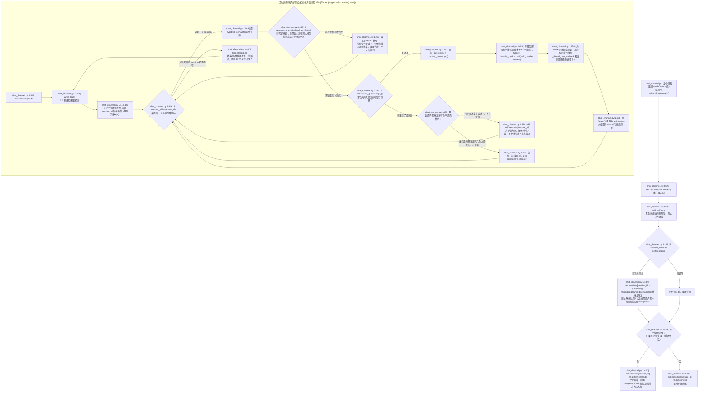

# chatgpt-on-wechat 核心源码级（Line-by-Line）超细颗粒度流程图

本文档提供了**变量级、函数级、代码行级**的微观流程解析。由于整个项目生命周期过于庞大，单张流程图无法被渲染，因此拆解为 **5 大核心链路图**，每一个节点都直接对应了源码的具体实现。

## 一、系统启动与通道调度引擎 (app.py)
对应 `app.py` 及 `ChannelManager` 的生命周期，它是整个系统的驱动器。

```mermaid
graph TD
    A1["app.py: L307 | if __name__ == '__main__':<br>系统启动点，进入主程序入口"] --> A2["app.py: L269 | def run(): 开始执行"]
    A2 --> A3["app.py: L273 | load_config()<br>进入 config.py 解析并加载 config.json 及环境变量入全局字典"]
    A3 --> A4["app.py: L275-L277 | sigterm_handler_wrap(signal...)<br>绑定 Linux 进程退出信号 (SIGINT, SIGTERM) 到包裹函数"]
    A4 --> A5["app.py: L280 | raw_channel = conf().get('channel_type', 'web')<br>提取通道配置"]
    A5 --> A6{"app.py: L282 | if '--cmd' in sys.argv:"}
    
    A6 -->|"是"| A7["app.py: L283 | channel_names = ['terminal']<br>强制使用终端通道模式"]
    A6 -->|"否"| A8["app.py: L285 | channel_names = _parse_channel_type(raw_channel)<br>调用 L23 将单字符串/列表规范化为标准 List"]
    
    A7 --> A9
    A8 --> A9{"app.py: L291 | 'web' not in channel_names?"}
    
    A9 -->|"如果允许Web(默认)且通道列表中没有 Web"| A10["app.py: L292 | channel_names.append('web')<br>自动追加 web 作为控制台"]
    A9 -->|"已有web或禁用了"| A11["app.py: L296 | _channel_mgr = ChannelManager()<br>实例化通道管理器 L38，初始化 self._channels 和 self._threads"]
    A10 --> A11
    
    A11 --> A12["app.py: L297 | _channel_mgr.start(channel_names, first_start=True)<br>调用通道启动入口进程"]
    A12 --> A13["app.py: L65 | with self._lock: <br>开启线程锁"]
    A13 --> A14{"app.py: L67 | for name in channel_names:<br>循环要启动的通道名"}
    
    A14 -->|"循环中"| A15["app.py: L68 | ch = channel_factory.create_channel(name)<br>调工厂方法生成通道对象 (如 WechatMPChannel)"]
    A15 --> A16["app.py: L70 | self._channels[name] = ch<br>登记实例入字典"]
    A16 --> A17["app.py: L72 | if self._primary_channel is None and name != 'web':<br>确立首选通道用于云端/插件向后兼容"]
    A17 --> A14
    
    A14 -->|"循环结束"| A18{"app.py: L78 | if first_start:"}
    
    A18 -->|"首次启动加载"| A19["app.py: L79 | PluginManager().load_plugins()<br>挂载所有启用的第三方外置插件模块"]
    A18 -->|"重启补充"| A21
    A19 --> A20["app.py: L81 | if conf().get('use_linkai'):<br>开启新后台线程跑云端客户端"]
    A20 --> A21["app.py: L94 | 重新排序通道列表<br>将 'web' 信道放在第一位保证干净日志"]
    
    A21 --> A22{"app.py: L103 | for i, (name, ch) in enumerate(ordered):<br>开始分配独立线程运行通道"}
    A22 -->|"分配线程"| A23{"app.py: L104 | if i > 0 and name != 'web':"}
    A23 -->|"是"| A24["app.py: L105 | time.sleep(0.1)<br>缓冲 0.1s 防日志错乱"]
    A23 -->|"否"| A25["app.py: L106 | t = threading.Thread(target=self._run_channel, ... daemon=True)<br>包装 _run_channel(name, ch) 到守护级线程"]
    A24 --> A25
    A25 --> A26["app.py: L107-108 | self._threads[name] = t / t.start()<br>保存线程句柄并执行！"]
    A26 --> A22
    
    A22 -->|"所有线程已发出"| A27["app.py: L299 | while True: time.sleep(1)<br>主线程陷入死循环，仅保持存活，业务交由其他线程处理"]
    
    subgraph thread_run ["进入新开的子线程 (app.py)"]
        A26 -.-> T1["app.py: L111 | def _run_channel(self, name: str, channel):<br>被启动的线程函数体"]
        T1 --> T2["app.py: L113 | channel.startup()<br>执行对应底层平台组件的各种常驻/监听代码"]
        T2 -.-> T3["app.py: L115 | except Exception as e:<br>若崩溃只打印，不退出主程序"]
    end
```

## 二、消息接收与上下文预处理 (chat_channel.py: compose_context)
这一阶段代表了当一个子通道（如飞书、微信）监听到了一条用户消息并封装成 `ChatMessage` 发入了本底座系统后的第一层拦截与意图分流。

```mermaid
graph TD
    B1["channel/xxxxx/xxxxx.py: (各平台底层触发回调)<br>得到底层原生消息数据结构"] --> B2["组装为规范的 common/chat_message.py: ChatMessage()<br>赋值 from_user_id, content, is_group 等"]
    B2 --> B3["chat_channel.py 子类调用<br>super().handle_text(msg) 等"]
    B3 --> B4["chat_channel.py: L43 | def _compose_context(self, ctype, content, ...)<br>开始把消息转为流转用的 Context 并鉴定是否合规"]
    
    B4 --> B5["chat_channel.py: L44 | context = Context(ctype, content)<br>创建 Context"]
    B5 --> B6{"chat_channel.py: L51 | first_in = 'receiver' not in context"}
    B6 -->|"是 (初入核心)"| B7["chat_channel.py: L57 | 将用户私有的 OpenAI API 密钥带入上下文"]
    
    B7 --> B8{"chat_channel.py: L59 | if context.get('isgroup', False):<br>群聊分支"}
    B8 -->|"是群聊"| B9["chat_channel.py: L65 | any([name in white_list, 包含 keyword])<br>严格鉴权：该群在此配置是否允许响应？"]
    B8 -->|"单聊"| B10["chat_channel.py: L94 | context['session_id'] = cmsg.other_user_id<br>单聊则将会话 ID 就是对方的用户 ID"]
    
    B9 -->|"不满足名单白名单"| B11["chat_channel.py: L89 | return None<br>丢弃该消息且不用发报错提示"]
    B9 -->|"满足名单"| B12{"chat_channel.py: L73 | 判断群内 session 是否共享模式<br>group_shared_session = True?"}
    B12 -->|"所有人共享记忆"| B13["chat_channel.py: L76 | session_id = group_id"]
    B12 -->|"记忆独立"| B14["chat_channel.py: L80 | session_id = cmsg.actual_user_id"]
    B13 --> B15["chat_channel.py: L96 | PluginManager().emit_event( ON_RECEIVE_MESSAGE )<br>⚡触发全局第一次插件事件！"]
    B14 --> B15
    B10 --> B15
    
    B15 -.->|"如果插件调用了 e_context.action = EventAction.BREAK_PASS"| B16["return e_context['context']<br>直接拿走修改后的，跳过后续所有清洗"]
    
    B15 --> B17{"chat_channel.py: L105 | 内容洗盘 (如果是TEXT类型)"}
    B17 --> B18{"chat_channel.py: L112 | if context.get('isgroup', False):"}
    
    B18 -->|"群聊清洗"| B19["chat_channel.py: L114 | 利用 check_prefix / check_contain 匹配触发词（如 @bot）"]
    B19 --> B20["chat_channel.py: L122 | if context['msg'].is_at: <br>验证黑名单 nick_name_black_list / 匹配是否开启了被艾特"]
    B20 --> B21["chat_channel.py: L133 | pattern = f'@{re.escape(self.name)}'<br>精准地使用正则从原文中把前缀或被 @ 机器人的名字挖走，留下纯净问题！"]
    
    B18 -->|"私聊清洗"| B22["chat_channel.py: L149 | check_prefix 检查单聊唤醒词 single_chat_prefix<br>同样从 content 中擦除"]
    
    B21 --> B23["chat_channel.py: L164 | img_match_prefix = check_prefix(image_create_prefix)<br>二次正则判断：是不是要画图（如配置的前缀'画'）？"]
    B22 --> B23
    
    B23 --> B24{"是不是画图？"}
    B24 -->|"是"| B25["chat_channel.py: L167 | context.type = ContextType.IMAGE_CREATE<br>意图改写为绘画"]
    B24 -->|"否"| B26["chat_channel.py: L169 | context.type = ContextType.TEXT<br>确立为文字意图"]
    
    B25 --> B27["chat_channel.py: L176 | return context<br>清洗完毕！扔给外层准备进死机队列！"]
    B26 --> B27
```

## 三、高并发异步排队调度引擎 (chat_channel.py: produce & consume)
这段代码是最核心的高可用控制区域，确保每秒一万条消息机器人也不会崩溃错乱。

## 四、事件路由、模型桥接器与远端网络请求(chat_channel.py: _handle & Bridge)
这里是工作池(ThreadPool)里每一个任务拿取消息后真正发请求拿文本的核心点，包含了极其复杂的事件插件处理与单例桥接模式映射。

```mermaid
graph TD
    D1["chat_channel.py: L178 | def _handle(self, context)"] --> D2{"chat_channel.py: L179 | 判空拦截"}
    D2 -->|"合法"| D3["chat_channel.py: L183 | reply = self._generate_reply(context)<br>进入消息的核心处理主干！"]
    
    D3 --> D4["chat_channel.py: L195 | EventContext(Event.ON_HANDLE_CONTEXT...)<br>⚡触发全局第二次插件事件！此钩子是最重要的：你在此刻劫持就不再访问 GPT！"]
    D4 --> D5{"插件是否接管了逻辑？<br>(e_context.is_pass())"}
    
    D5 -->|"被接管"| D6["跳过网络访问直接使用拦截器传向来的 reply 对象"]
    D5 -->|"未被接管"| D7{"chat_channel.py: L204 | 鉴定意图：\n是 文字/绘画请求 吗？"}
    
    D7 -->|"是文字/画画"| D8["chat_channel.py: L206 | 修改 Channel 基类的 build_reply_content() 方法继续"]
    
    D7 -->|"这是一条语音录音 (ContextType.VOICE)"| D9["chat_channel.py: L207 | cmsg.prepare() 保存本地录音"]
    D9 --> D10["chat_channel.py: L213 | any_to_wav(..., wav_path)<br>调用 FFmpeg 统一成标准 wav 音频格式"]
    D10 --> D11["chat_channel.py: L218 | super().build_voice_to_text(wav_path)<br>调用音频转换 AI（例如阿里语音识别成中文字体）"]
    D11 --> D12["chat_channel.py: L220-L224 | 清除生成的本地音频碎片！"]
    D12 --> D13["chat_channel.py: L229 | 将识别出来的文字包装成 Text Context 进行自我递归（self._generate_reply）再次回到 D3 让文字进行回答"]
    
    D8 --> D14["channel.py: L71 | 进入抽象层: build_reply_content(query, context)"]
    D14 --> D15{"channel.py: L76 | 检测了 conf 里面是否有使用 'agent' 模式？"}
    D15 -->|"开启 Agent(代理)"| D16["channel.py: L90 | Bridge().fetch_agent_reply(...)"]
    D15 -->|"普通模式"| D17["channel.py: L102 | Bridge().fetch_reply_content(...)"]
    
    D17 --> D18["bridge.py: L99 | def fetch_reply_content(...)"]
    D18 --> D19["bridge.py: L100 | return self.get_bot('chat').reply(query, context)<br>将路由权转交给 Bot 基类函数"]
    
    D19 --> D20["bridge.py: L83 | def get_bot(self, typename):"]
    D20 --> D21["bridge.py: L86 | 由于采用桥接器隔离，获取根据 Config 指定在启动时装载的名称（如 chatgpt 或 xunfei）"]
    D21 --> D22["bridge.py: L91 | bot_factory.create_bot(self.btype[typename])<br>去工厂创建真正的聊天机器人"]
    D22 --> D23["bot_factory.py: L7 | def create_bot(bot_type):<br>一大坨 If Else，依靠字符串获取指定的具体子类实例（如 models.openai.OpenAIBot）"]
    
    D23 --> D24["models/.../___.py | 调用其实现的 \ndef reply(self, query, context):"]
    D24 --> D25["各类子类内部：\n使用 common.memory 读取过去的 session 聊天信息(上下文窗口机制)<br>组装携带 System Prompt 的最终 Request Payload"]
    D25 --> D26["向对应的 API 厂商服务器使用 python requests 或 socket 进行远端等待堵塞请求......"]
    D26 --> D27["提取回包 response 的 choices 中的回答字段，包装为 Reply<br>return Reply(ReplyType.TEXT, reply_content)"]
    D27 --> D28["大模型响应一路层层回跳栈区，返回到 _handle(context) 中的 D3 断点处"]
```

## 五、消息美化后加工与落地发送 (chat_channel.py: decorate & send)
这里将取得的呆板文字 AI 答复，结合所在的信道做群聊 @ 修饰并发向厂商最终 API 发包给客户端设备。

```mermaid
graph TD
    E1["chat_channel.py: L189 | _decorate_reply(context, reply)<br>拿到上面传来的原生答案对象"] --> E2["chat_channel.py: L189 | def _decorate_reply(context: Context, reply: Reply)"]
    
    E2 --> E3["chat_channel.py: L250-254 | EventContext(Event.ON_DECORATE_REPLY...)<br>⚡触发全局第三次插件事件！(用来修饰、或者改写、如转语音转视频插件拦截替换点)"]
    E3 --> E4{"chat_channel.py: L258 | 插件没有跳过吗（is_pass）?"}
    
    E4 -->|"如果该回复不合法"| E5["chat_channel.py: L260 | 将类型改为 ERROR 类型回复报错码对象"]
    
    E4 -->|"如果正常文字"| E6["chat_channel.py: L264 | if reply.type == ReplyType.TEXT:"]
    E6 --> E7{"chat_channel.py: L266 | 原始意图希望它是声音？<br>desire_rtype == ReplyType.VOICE"}
    E7 -->|"是"| E8["chat_channel.py: L267 | build_text_to_voice(reply.content)<br>交给云端转成返回的 VOICE 对象，并使用它重新递归装点！"]
    E7 -->|"否"| E9{"chat_channel.py: L269 | if context.get('isgroup', False):<br>是群聊？"}
    
    E9 -->|"是"| E10["chat_channel.py: L271 | 回复文字强行加上 @实际艾特者 的名字\n然后拼合 group_chat_reply_prefix 这样的全局预制前缀/后缀"]
    E9 -->|"单聊"| E11["chat_channel.py: L274 | 只拼合单聊前缀（如 [bot] ）与 single_chat_reply_suffix 后缀"]
    
    E10 --> E12["把文字覆盖到 reply.content，return 返回！回到 L192"]
    E11 --> E12
    E8 --> E12
    
    E12 --> E13["chat_channel.py: L192 | 调用 self._send_reply(context, reply)"]
    E13 --> E14["chat_channel.py: L288 | 第一步：封装 EventContext(Event.ON_SEND_REPLY)"]
    E14 --> E15["chat_channel.py: L289 | ⚡触发全局最后一次（第四次）插件事件！"]
    
    E15 --> E16{"chat_channel.py: L296 | 如果插件没阻止且回复类型存在合法"}
    
    E16 --> E17{"chat_channel.py: L300 | if reply.type == ReplyType.TEXT:"}
    
    E17 -->|"是纯文本"| E18["chat_channel.py: L301 | self._extract_and_send_images(reply, context)<br>这是专门应付混合排版的：用正则提取这段富文本里有没有包含 [图片: URL] 的奇怪字符"]
    
    E18 --> E19{"发现有分离出的隐式多媒体图片切片了没？"}
    
    E19 -->|"包含切片媒体"| E20["使用 time.sleep 间隔发送：先剥离出文字单发给 _send(reply, context)<br>再遍历包含的多个富媒体分别投递 _send()，防止平台由于不支持富文本导致报错截断"]
    
    E19 -->|"文本就是干干净净纯文本"| E21["直接调用 self._send(reply, context)"]
    E17 -->|"本来就是图片或者语音"| E21
    
    E21 --> E22["chat_channel.py: L393 | def _send(self, reply, context, retry_cnt=0)"]
    E22 --> E23["chat_channel.py: L395 | 真正进入自己各个平台所在的子组件（例如微信、飞书、QQ模块）的 self.send(reply, context)<br>（这里调起了厂商的 API HTTP 发包函数）"]
    
    E23 -.->|"抛出了报错导致失败"| E24["chat_channel.py: L401 | if retry_cnt < 2: <br>利用线程 sleep 休眠做失败自我限时并递加重试机制的递归调用"]
    
    E23 --> E25["由于上面我们在 C19(ThreadPool) 里给他做了 add_done_callback <br>Python 线程池检测到函数正常返回将自动调用 _thread_pool_callback 释放许可信号(semaphore.release)<br>至此，用户的发送周期，圆满画上句号。"]
```

