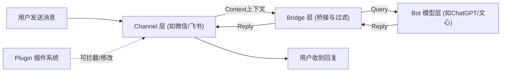

# chatgpt-on-wechat 项目深度学习教程

这份教程将带你从零开始深入理解 `chatgpt-on-wechat` 项目的核心架构、工作流程和关键代码，帮助你快速上手并具备二次开发的能力。

---

## 1. 项目概述与架构图

**核心功能**：`chatgpt-on-wechat` 是一个强大的智能机器人项目，它可以接入多种大语言模型（如 ChatGPT、文心一言、Claude、Gemini、智谱、星火等），并将这些模型的能力通过多种渠道（如微信公众号、企业微信、个人微信、飞书、钉钉、Web、终端等）提供给用户。

该项目采用高度模块化、松耦合的架构设计，方便横向扩展接口通道（Channel）和对话模型（Bot）。

**核心目录结构与架构：**

```text
chatgpt-on-wechat/
├── app.py                  # 项目入口文件，负责加载配置并启动应用和通道管理器(ChannelManager)
├── config.py               # 配置管理中心，负责加载 config.json、环境变量和全局配置设定
├── config-template.json    # 配置模板文件
├── requirements.txt        # 核心依赖清单
│
├── channel/                # 通道模块：消息接收与发送（与外部平台交互）
│   ├── channel.py          # 通道基类（定义发送/接收等接口）
│   ├── chat_channel.py     # 核心聊天通道逻辑（消息排队、并发处理、前缀过滤、触发机制）
│   ├── wechatmp/           # 微信公众号通道实现
│   ├── feishu/             # 飞书通道实现
│   ├── web/                # Web端实现
│   └── ...                 
│
├── bridge/                 # 桥接模块：连接 通道(Channel) 和 模型(Bot)
│   ├── bridge.py           # 核心桥接器，负责路由当前配置该使用哪个AI模型实例化
│   └── context.py          # 上下文定义 (ContextType, ReplyType)，封装了每次聊天的类型和内容
│
├── models/                 # 模型模块：各类AI大模型的具体API请求实现
│   ├── bot_factory.py      # 模型工厂类（根据配置实例化对应的Bot）
│   ├── chatgpt/            # ChatGPT 接口对接
│   ├── baidu/              # 百度文心一言对接
│   ├── zhipuai/            # 智谱AI对接
│   └── ...                 
│
├── plugins/                # 插件系统模块（支持拦截消息、修改回复、增加特定命令如画图、搜索机制）
├── common/                 # 公共工具类（日志 logger、并发队列 Dequeue、常量 const 等）
└── voice/                  # 语音模块：支持语音识别(STT)与语音合成(TTS)
```

**宏观架构设计：**



---

## 2. 环境配置指南

在本地启动项目前，需要配置好相应的环境。

### 2.1 基础环境依赖
- **Python 版本**：推荐 `Python 3.8 - 3.10` 之间（强烈建议使用虚拟环境如 `conda` 或 `venv`）。
- **Git**：用于克隆项目。

### 2.2 具体安装命令

```bash
# 1. 克隆项目
git clone https://github.com/zhayujie/chatgpt-on-wechat.git
cd chatgpt-on-wechat

# 2. 创建并激活虚拟环境 (以 venv 为例)
python3 -m venv venv
source venv/bin/activate  # Mac/Linux 系统
# venv\Scripts\activate   # Windows 系统

# 3. 安装核心依赖库
pip install -r requirements.txt

# 4. 可选配置 (根据你使用的语音库或飞书/钉钉通道，需要安装可选依赖)
# pip install -r requirements-optional.txt
```

### 2.3 必须注意的基础环境问题

1. **网络问题**：如果你在国内使用 OpenAI (ChatGPT) 模型，必须要在 `config.json` 中配置代理（如 `"proxy": "http://127.0.0.1:7890"`）或者使用国内可访问的 API Base。
2. **Channel 依赖**：如果你打算运行飞书或钉钉机器人，注意看 `requirements.txt` 中相关的包（如 `lark-oapi`, `dingtalk_stream`）是否安装成功。

---

## 3. 核心工作流程解析

这是项目最核心的流程：**“用户发送消息 -> 触发通道过滤 -> 交由桥接器 -> Bot生成回复 -> 通道处理发回”**。我们结合代码文件一步步拆解。

**步骤 1：消息接收与包装 (`channel/chat_channel.py`)**

当某个具体的平台（比如网页版或企业微信）监听到了一条用户消息，它会调用 `self.produce(context)` 将消息放入一个**消息队列 (Dequeue)** 中。
`ChatChannel` 初始化时会在后台启动一个 `consume()` 守护线程，该线程通过线程池 (`ThreadPoolExecutor`) 不断从队列中抓取上下文进行处理。这就支持了高并发下的消息积压排队机制。

**步骤 2：判断是否需要回复与前后缀处理 (`_compose_context` 方法)**

在 `chat_channel.py` 中，消息并非直接发给AI模型，而是先进行加工：
- 代码会检查消息是否来自白名单群聊 (`group_name_white_list`)、用户昵称黑名单 (`nick_name_black_list`)。
- 检查消息是否带有触发前缀（如 `@bot` 或者是私聊触发词）。
- 剔除前缀，识别消息意图类型（文本 `ContextType.TEXT`、触发画图 `ContextType.IMAGE_CREATE`）。

**步骤 3：桥接路由调用 (`bridge/bridge.py`)**

通道层初步处理好的 `Context` 接下来交给了 Bridge。Bridge 是一个单例(`@singleton`)，在初始化时它读取了配置中的大模型 (`model_type = conf().get("model")`)。
当调用 `self.build_reply_content(query, context)`（内部走到 `Bridge().fetch_reply_content`）时，桥接器会通过 `BotFactory` 去实例化（比如加载 `OpenAIBot`），进而调用大模型的 API。

**步骤 4：Bot 生成内容 (`models/chatgpt/chat_gpt_bot.py` 等)**

具体的 Bot 会继承接口类。将上下文携带的 `session_id` 抓取对应的历史聊天记录。组装请求参数 (Temperature, Top_p 等)，并向 OpenAI 接口或者对应厂商接口发起 Http 请求，将结果构造成项目体系内的 `Reply` 对象 (`ReplyType.TEXT`) 扔回去。

**步骤 5：加工并发送回复 (`_decorate_reply` 和 `_send_reply`)**

此时返回到了 `channel/chat_channel.py`。
- 如果群聊不需要@，直接返回文本；如果需要@，拼接 `@XXX\n 返回内容`。
- 如果存在媒体内容，系统具备从文本中提取 `` 或者直接图片 URL (`_extract_and_send_images` 方法)的能力，分段发送。
- 最终调用每个子渠道特定实现的 `self.send()` 方法调用各个平台的 API 把内容塞还给用户。

---

## 4. 关键代码段解读

我们从核心文件中挑选了三段最精妙的代码，它们直接体现了系统健壮性和扩展性。

### 4.1 通道多路复用与并发启动引擎 (`app.py` -> `ChannelManager`)

为了能同时启动 Web 版、微信版和飞书版大模型聊天，项目中设计了统一的管理器：

```python
class ChannelManager:
    # ... 省略初始化代码 ...
    
    def start(self, channel_names: list, first_start: bool = False):
        """
        开启多线程同时运行配置中的多种 Channel。
        """
        with self._lock:  # 线程锁，防止在高并发时重复创建
            channels = []
            for name in channel_names:
                # 依靠面向对象和工厂模式，这里不关心是Web还是Dingtalk
                ch = channel_factory.create_channel(name) 
                self._channels[name] = ch
                channels.append((name, ch))

            # ... 省略插件加载逻辑 ...
            
            # 使用列表存放频道，在循环里为每个 channel 开一个独立守护线程运行它的 startup()
            for i, (name, ch) in enumerate(ordered):
                # web控制台先行，其他渠道延迟启动避免日志混乱
                if i > 0 and name != "web": 
                    time.sleep(0.1)
                t = threading.Thread(target=self._run_channel, args=(name, ch), daemon=True)
                self._threads[name] = t
                t.start()
                logger.debug(f"[ChannelManager] Channel '{name}' started in sub-thread")
```
**解读**：这段代码解耦了业务逻辑和底层通道，通过 `channel_factory` 去动态创建对应的服务，将不同的即时通讯平台统筹规划在了统一的生命周期管理（Start, Stop, Restart）中。

### 4.2 Bot 工厂的桥接设计 (`models/bot_factory.py`)

```python
def create_bot(bot_type):
    """
    create a bot_type instance
    :param bot_type: bot type code
    :return: bot instance
    """
    # 巧妙利用 Python 的延时 import（在函数内部 import）。
    # 好处：如果没有用到 Gemini 模型，其依赖库或者模块就不会被提前加载，极大地节省了内存空间并避免环境依赖错误。
    if bot_type == const.BAIDU:
        from models.baidu.baidu_wenxin import BaiduWenxinBot
        return BaiduWenxinBot()
        
    elif bot_type in (const.OPENAI, const.CHATGPT, const.DEEPSEEK):
        from models.chatgpt.chat_gpt_bot import ChatGPTBot
        return ChatGPTBot()
    
    # ... 其他数十种厂商的分支支持 ...
```
**解读**：工厂模式的最佳实践。在系统启动时，由 `bridge.py` 结合配置文件决定我们需要什么引擎实例。它能随时切换底层驱动，而完全不需要动项目其它地方的代码（符合面向对象“开闭原则”：对修改封闭，对扩展开放）。

### 4.3 会话并发队列处理 (`channel/chat_channel.py` -> `consume`)

机器人回复通常非常耗时（尤其是调用国外 API），如何保证用户不串台，以及同时服务成百上千的用户？

```python
def consume(self):
    while True:
        with self.lock:
            session_ids = list(self.sessions.keys())
            
        for session_id in session_ids:
            with self.lock:
                # 提取每人的消息队列，和针对该 session 控制并发数的信号量 Semaphore
                context_queue, semaphore = self.sessions[session_id]
                
            if semaphore.acquire(blocking=False):  # 获取许可资源，表示当前 session_id 正在处理的任务不超载
                if not context_queue.empty():
                    context = context_queue.get()  # 获取队列首个消息
                    
                    # 掷入通用线程池 handler_pool 异步处理
                    future: Future = handler_pool.submit(self._handle, context)
                    
                    # 挂载回调：成功或抛出异常时会释放信号量 (semaphore.release())
                    future.add_done_callback(self._thread_pool_callback(session_id, context=context))
                    
                    # 记录这个 future 对象，以便之后允许 cancel 断开会话
                    # ... 省略
                else:
                    semaphore.release() # 队列空啦，归还许可
        time.sleep(0.2)
```
**解读**：这就是为什么在 `config.json` 里有一个配置叫 `"concurrency_in_session": 1`。为保证每个用户(session)的聊天是连贯的，需要避免串行或者乱序回复。这段使用信号量(`Semaphore`)锁加上共享线程池(`ThreadPoolExecutor`)，实现了完美的消息分发：整体并发高效，但针对单一用户又保持了队列有序。

---

## 5. 本地运行与调试步骤

现在，我们通过 `Terminal（终端）` 和 `Web 控制台` 两个最简单的通道从零拉起服务。

1. **环境初始化并构建配置**：
   在根目录下拷贝模板为具体的配置文件：
   ```bash
   cp config-template.json config.json
   ```
2. **修改配置文件 (`config.json`)**：
   打开这份文件，找到以下基础核心字段修改为您自己的参数（下面是一个跑通百度的通用最小配置样例）：
   ```json
   {
     "channel_type": "terminal",
     "model": "wenxin", 
     "baidu_wenxin_api_key": "你的API_KEY",
     "baidu_wenxin_secret_key": "你的SECRET_KEY",
     "single_chat_prefix": ["bot"],
     "debug": true
   }
   ```
   > 提示：如果你想用 OpenAI 接口，将 `model` 改为 `gpt-3.5-turbo`，配置 `open_ai_api_key` 和（选填解决被墙问题的）`open_ai_api_base`。

3. **运行程序并观测启动日志**：
   在虚拟环境激活状态下执行：
   ```bash
   # 测试最简单的终端交互：--cmd 将强制加载 terminal 渠道
   python app.py --cmd
   ```
4. **效果验证**：
   程序出现如下日志代表成功启动：
   ```
   [INIT] Channel: terminal
   [INIT] Model: wenxin
   ...
   [ChannelManager] Channel 'terminal' started in sub-thread
   ```
   在终端的输入行直接敲除：`bot 你好`（注意前置了你在 `single_chat_prefix` 配置的触发词），然后按下回车。如果你等几秒能收到打印的回复，即代表整个全栈链路畅通运行！

---

## 6. 后续学习建议与扩展方向

结合您现在掌握了整体框架的心智模型，以下是不同需求下的学习行动建议：

### 🎯 目标一：想深入理解代码，下一步看什么？
建议研究 **事件插件系统 (Plugins)** 目录。
该项目拥有一个极美的事件触发系统（包含：`ON_RECEIVE_MESSAGE` -> `ON_HANDLE_CONTEXT` -> `ON_DECORATE_REPLY` -> `ON_SEND_REPLY`）。
- **去读哪个代码**：`plugins/plugin.py` 和 `plugins/hello/hello.py` 示例。
- **能学到什么**：学习 Python 里的装饰器机制和优先级排序。你能理解为什么别人能在聊天中间插入“天气查询”或是“自定义指令”功能。

### 🛠 目标二：我想魔改功能，从哪里下手术刀最安全？
千万不要去修改 `chat_channel` 这种核心控制中心，容易造成多线程崩溃。

1. **增添新大模型能力**：去 `models/` 目录下新建一个文件夹。实现 `Bot` 基类，重写 `reply` 函数（参考 `baidu/baidu_wenxin.py`）。然后在 `models/bot_factory.py` 里将配置名映射到你新写的代码，这就大功告成了！
2. **增添自定义逻辑（如记录每次聊天入您的私有数据库）**：不要改系统源码！在 `plugins/` 目录新建你个人的插件，通过订阅 `ON_HANDLE_CONTEXT` 事件，捕捉到 context 后写入你自己的 MySql / Redis，这样你随时可以安全平滑合并社区最新的代码。

### 🚀 目标三：我想部署上线，必须要注意什么？
1. **进程守护**：在真实服务器上推荐使用 `nohup python app.py > run.log 2>&1 &` 或者 使用项目根目录提供的 `Dockerfile` 利用 Docker 进行运行管理。
2. **Token安全性**：所有的密钥，比如 `wechatmp_token` (微信公众号服务token) 或 `openai_api_key`，坚决不要提交到公网 Git 仓库，生产环境建议把配置文件里写空，启动前导出环境变量：`export OPENAI_API_KEY=xxx`，项目会自动合并并覆盖（详见 `config.py` 的解析逻辑）。
3. **连接存活**：部分机器人如基于 WebSocket 长链接的飞书/钉钉，如果不常驻网络代理和进程挂起检查，会面临断连失效问题，需保证稳定连接并保留足够的日志空间(`debug: false`)避免系统磁盘被写满。
